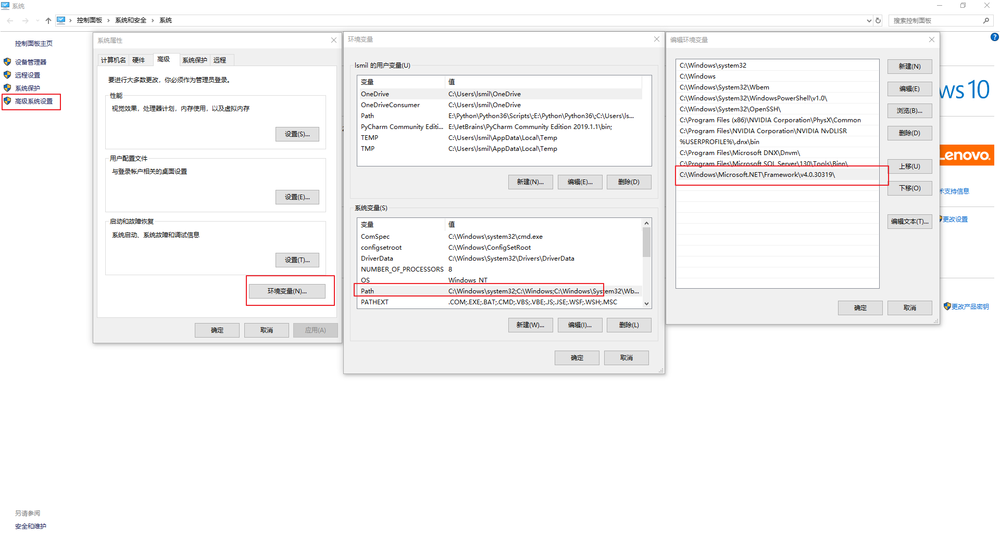

## Sublime Text3配置C#开发环境

### 步骤一：

在C:\Windows\Microsoft.NET\Framework\v4.0.30319目录里创建一个RunCSharp.bat文件，可以用TXT文档创建，然后将后缀名改为bat。将以下内容复制进去.

```
@ECHO OFF
cd %~dp1
ECHO Compiling %~nx1.......
IF EXIST %~n1.exe (
DEL %~n1.exe
)
csc %~nx1
IF EXIST %~n1.exe (
ECHO -----------OUTPUT-----------
start %~n1
)
```

### 步骤二：

将C:\Windows\Microsoft.NET\Framework\v4.0.30319\这个路径添加进环境变量里。在环境变量的设置里选择Path



### 步骤三：

打开Sublime Text3中看看有没有C#这个编译系统：Tools->Build System。有的话就用这个。没有的话新建一个C#.sublime-build文件，将以下内容复制进去。

```
{
    "cmd": ["RunCSharp.bat", "$file"],
    "file_regex": "^(...*?):([0-9]*):?([0-9]*)",
    "selector": "source.cs",
    "encoding": "cp936"
}
```

保存在Sublime Text安装目录里的Packages\User里。如果你的是绿色版的Sublime Text，则保存在Sublime Text 3x64\Data\Packages\User

配置完成！

**[改编链接](http://www.cnblogs.com/muyouking/p/6542649.html)**

S