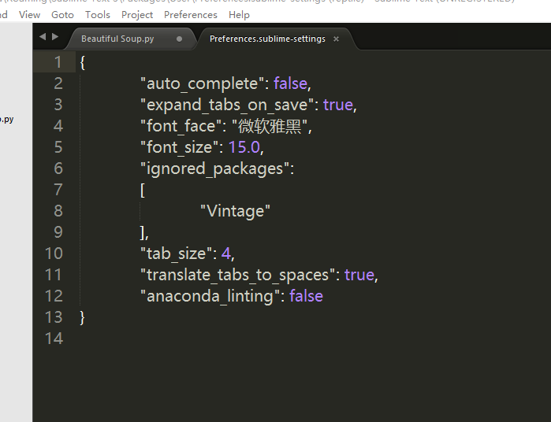

## Sublime Text3去掉白色框框

出现白色框框是因为不符合PEP8标准

可以装一个 AUTOPEP8 插件，然后按 `Ctrl` + `Alt` + 8 就会自动帮你PEP8格式化，白色框框就会消失了

安装步骤：

```
Ctrl + Shift + p
选择install package
输入AUTOPEP8
ok
```

要去掉只需在 Sublime > Preferences > Package Settings > Anaconda > Settings User 中设置关闭：   {“anaconda_linting”: false} 



