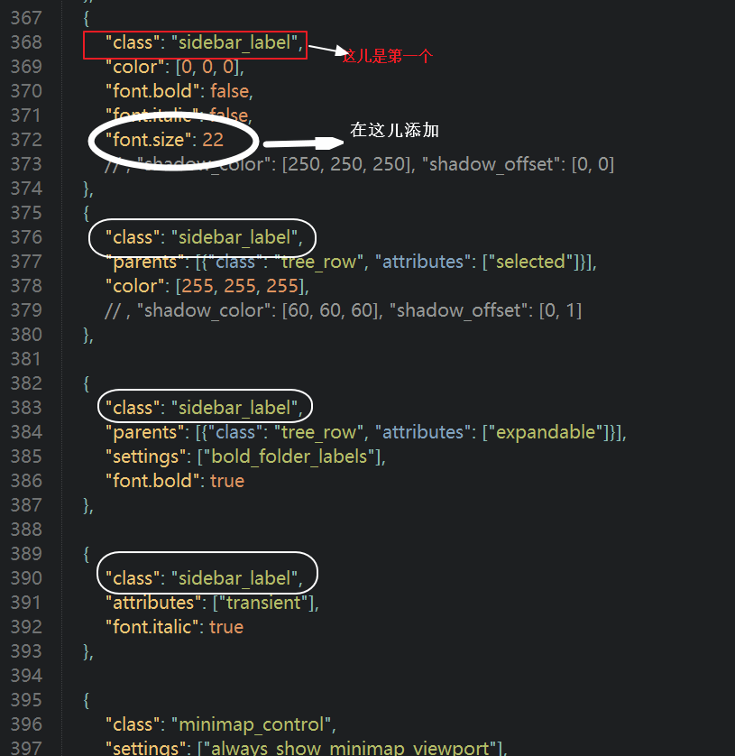
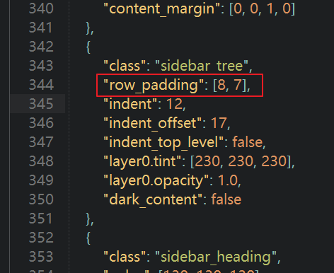

## Sublime Text3设置左侧导航栏的字体大小和每行高度

1. 安装`PackageResourceViewer` 包

   ```
   Ctrl+Shift+p
   找到Package Control:Install
   输入PackageResourceViewer
   下载
   ```

2. 调整左侧导航栏的字体大小和每行高度

   ```
   Ctrl+Shift+p
   输入PackageResourceViewer: Open Resource 回车，打开包列表
   选择 Theme - Default，再选择 Default.sublimt-theme
   ```

   - 调整字体

     ```
     搜索或直接找到第一个class为sidebar_label，在 "class": "sidebar_label" 后边加一行："font.size": 14
     ```

     

   - 调整高度

     

