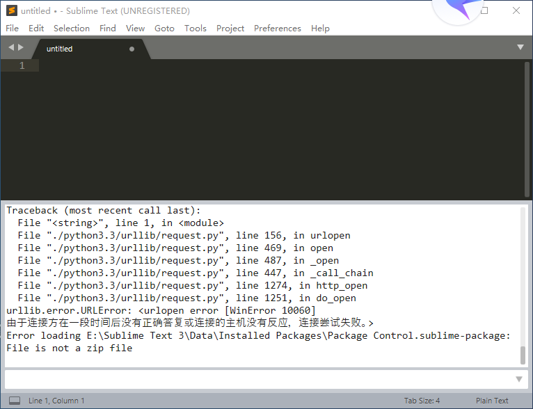
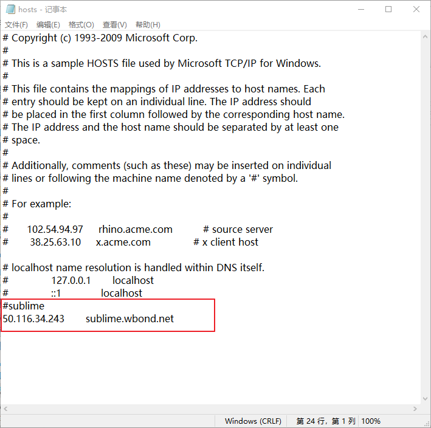
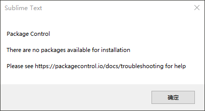
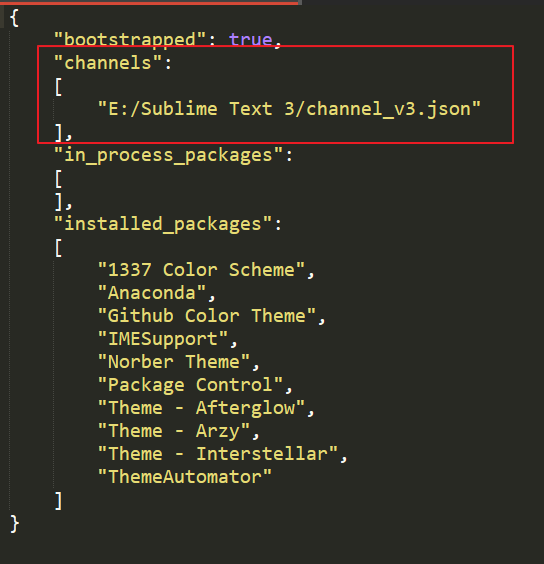

## 最新Sublime Text3安装package control

​	大概从2019年开始，不知道为啥，以前安装package control的方式不管用了，如果将下图所示的代码复制到控制台后：

```
import urllib.request,os; pf = 'Package Control.sublime-package'; ipp = sublime.installed_packages_path(); urllib.request.install_opener( urllib.request.build_opener( urllib.request.ProxyHandler()) ); open(os.path.join(ipp, pf), 'wb').write(urllib.request.urlopen( 'http://sublime.wbond.net/' + pf.replace(' ','%20')).read())
```

就会出现如下错误：



**解决办法**

找到c盘的hosts文件，该文件路径为：C:\Windows\System32\drivers\etc，在最后加上下图标出的内容，然后保存。这时候就不会出现上图的错误了。



但是这个装好以后当你点击install package时会出现如下错误：



在网上查了很久后终于解决了，我就不说为啥了，直接说怎么做吧！

首先需要下载一个channel_v3.json的文件，然后随便你保存在那个路径中，但是要在Sublime Text3中选择Preference->Package Settings->Package Control->Setting-User，

在该文件中加上你刚才存放channel_v3.json的路径



这时候再重启sublime text3大功告成！