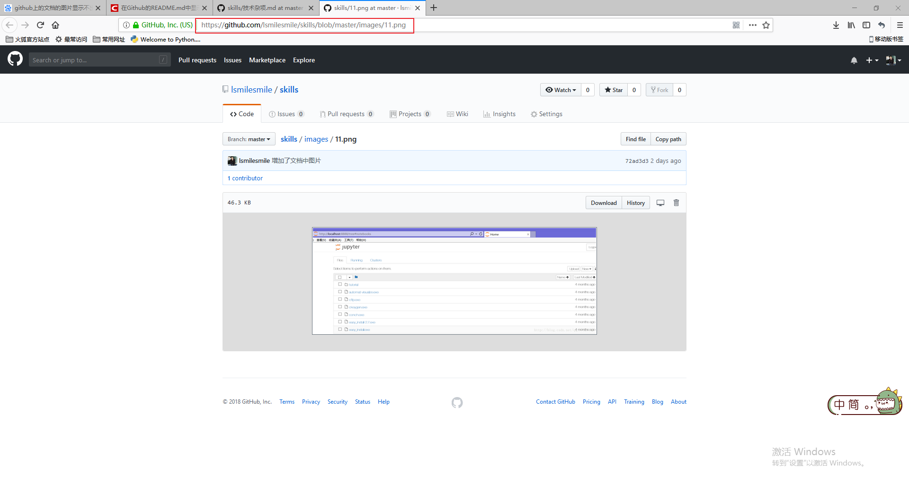
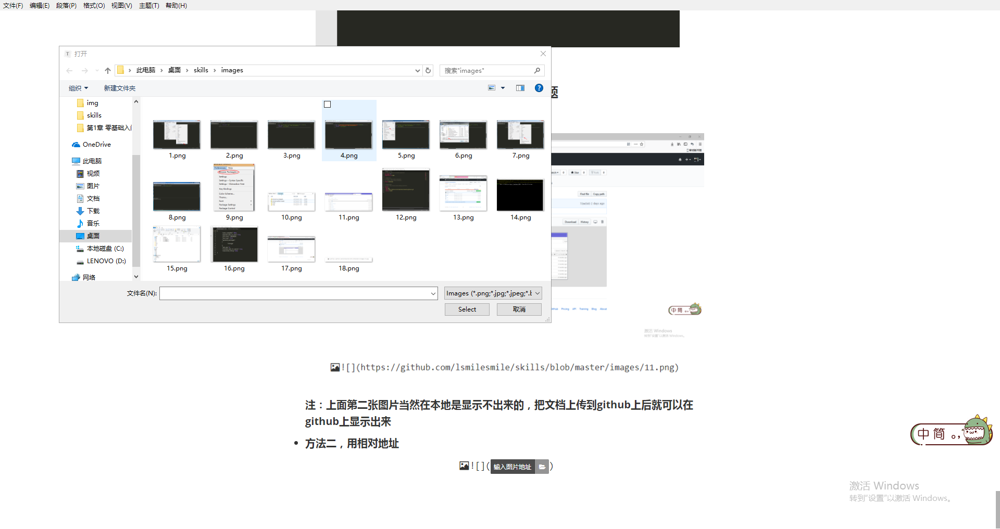

## github中markdown文档中的图片显示问题

- **方法一，直接把图片的url放入文档的图片地址中**

  

  

  **注：上面第二张图片当然在本地是显示不出来的，把文档上传到github上后就可以在github上显示出来**

- **方法二，用相对地址**

  先直接选择本地图片

  

  选择本地图片后，把地址改成下图所示的地址，注意，这时候在本地是可以显示出来的，但是如果传到github上有时候是显示不出来的，解决办法：把下面的正斜杠改成反斜杠即可。

  

  

  这样就大功告成！

