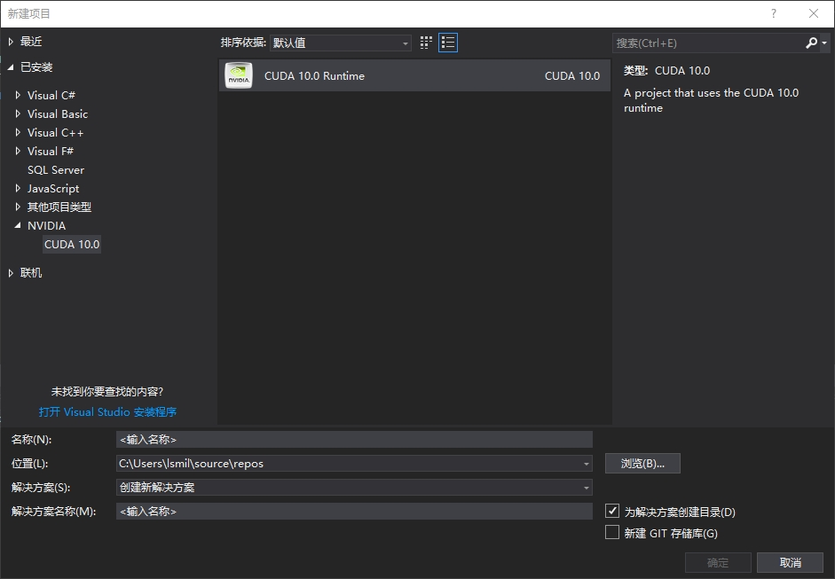
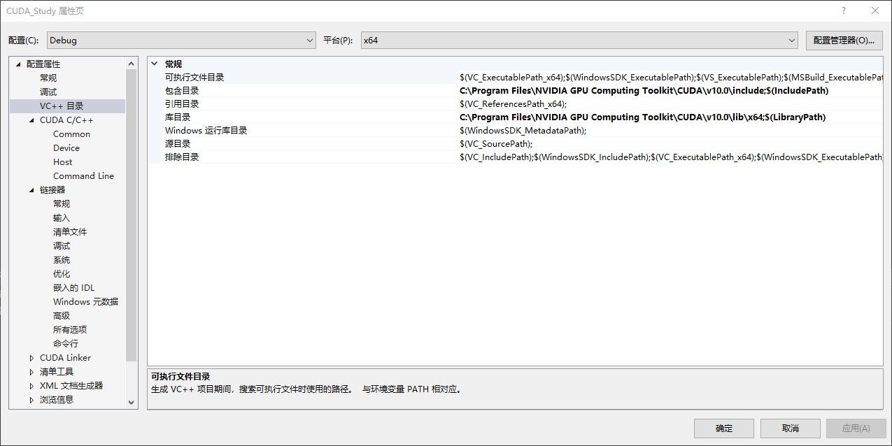
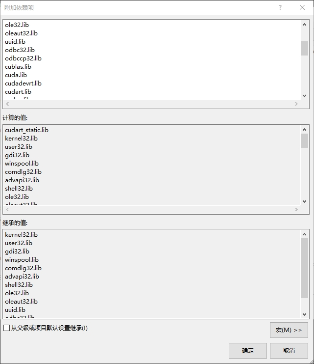
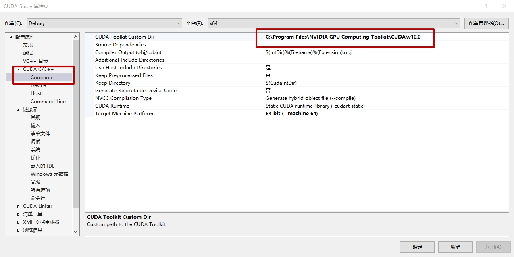
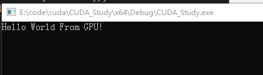

### CUDA编程环境配置

#### 一、安装cuda

CUDA安装[链接](<https://github.com/lsmilesmile/skills/blob/master/GTX1050CUDA10.0VS2017win10.md>)


#### 二、vs2017环境配置

1. 新建项目

   

2. 属性配置

   包含目录和库目录

   

   链接器 -> 输入

   

   这里面的静态库文件在：C:\Program Files\NVIDIA GPU Computing Toolkit\CUDA\v10.0\lib\x64，全部添加进去。

   CUDA C/C++

   


#### 三、代码测试

将原来的kernel.cu中的代码删去，增加代码：

```cpp
#include <iostream>

__global__ void myfirstkernel (void)
{}

int main(void) {
	myfirstkernel << <1, 1 >> > ();
	printf("Hello CUDA!\n");
	return 0;
}
```

结果：



