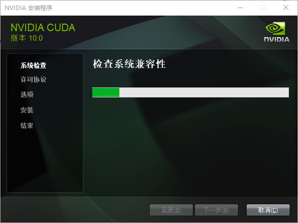
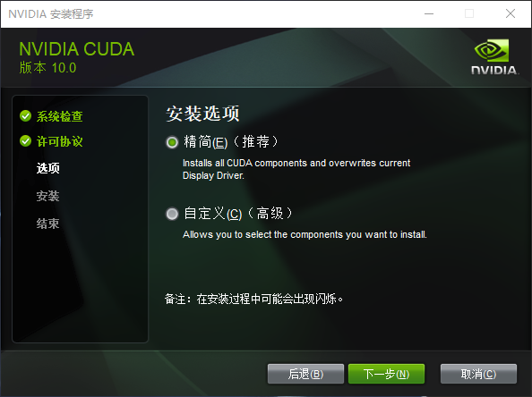
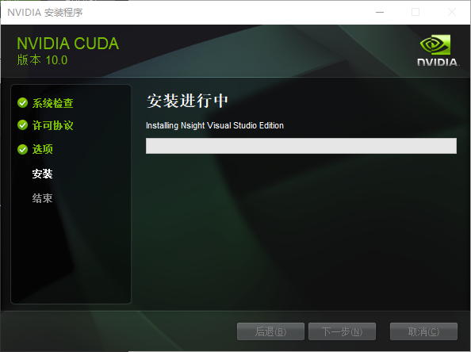
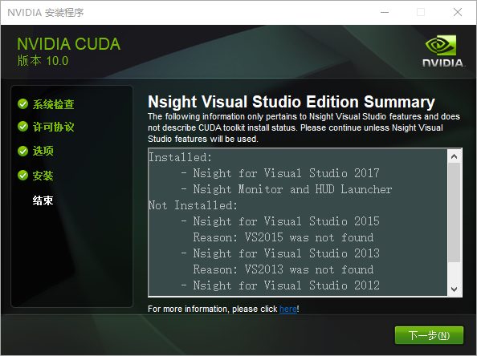
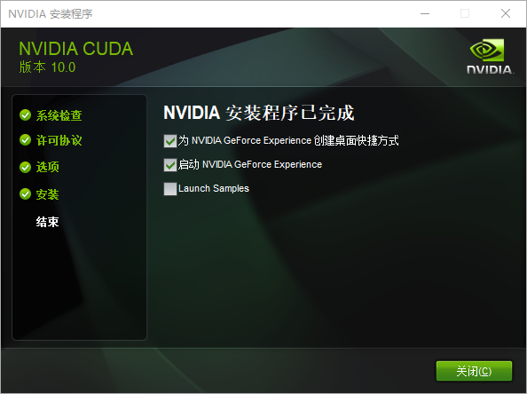
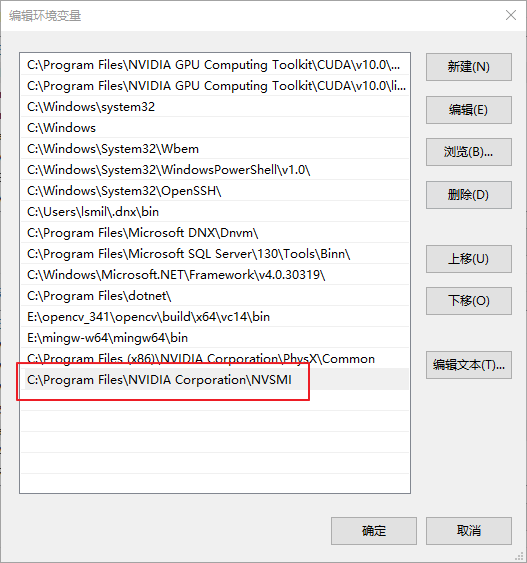
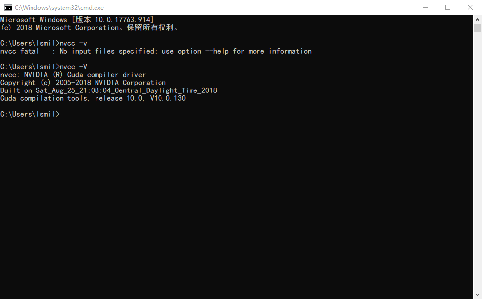
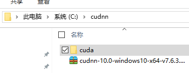

### GTX1050+CUDA10.0+VS2017+win10环境安装

> data:2020.08.02
>
> author:liuxiao


#### 一、相关安装包下载地址

vs2017以及其他版本[下载地址](https://visualstudio.microsoft.com/zh-hans/vs/older-downloads/);

cuda10.0[下载地址](https://developer.nvidia.com/cuda-toolkit-archive)，包括其他版本，我这下载的10.0，其他的版本和vs2017能否成功运行dlib的人脸识别的示例目前还不清楚。

cudnn下载需要先注册登录后才能下载，[cudnn官网](https://developer.nvidia.com/cudnn)，登录后的cudnn[下载地址](https://developer.nvidia.com/rdp/cudnn-archive)，下载与cuda10.0对应版本的cudnn；


#### 二、环境安装

**1、安装cuda**

我选的默认路径：





同意并继续



我选择的是精简，下一步





继续下一步



点击关闭

由于我安装的默认路径，所以将C:\Program Files\NVIDIA Corporation\NVSMI添加到系统环境变量



检查是否安装好，在命令行输入nvcc -V，若出现一下版本信息则表示安装成功：




#### 2、安装cudnn

刚才下载的cudnn是个压缩文件，我在c盘根目录下建一个文件夹，命名位cudnn，解压出来是一个cuda文件夹：



再添加三个环境变量：

```
C:\Program Files\NVIDIA GPU Computing Toolkit\CUDA\v10.0\bin
C:\Program Files\NVIDIA GPU Computing Toolkit\CUDA\v10.0\extras\CUPTI\libx64
C:\cudnn\cuda\bin
```

把下列文件分别按照文件夹放到下面目录：

```
C:\cudnn\cuda\bin\cudnn64_7.dll  放到
C:\Program Files\NVIDIA GPU Computing Toolkit\CUDA\v10.0\bin\
C:\cudnn\cuda\include\cudnn.h    放到
C:\Program Files\NVIDIA GPU Computing Toolkit\CUDA\v10.0\include\
C:\cudnn\cuda\lib\x64\cudnn.lib  放到
C:\Program Files\NVIDIA GPU Computing Toolkit\CUDA\v10.0\lib\x64\
```

至此，cuda和cudnn的环境就配置好了，下面我重启一下。

