# VMware14安装Ubuntu16.04

#### 1、下载安装VMware14

#### 2、下载安装Ubuntu16.04

​	这儿说一下，当我们去官网下载的时候发现有server版和client版，这时选择哪个呢？下面接单说一下区别：

```
个人电脑上必备的组成部分是GUI（图形用户界面）。Ubuntu的桌面版默认带有 Gnome GUI，不过，如果你有需要，也可转换为KDE或X。而服务器版是不安装GUI的。除了日常维护，服务器不打算用于本地交互，因而GUI不仅没有存在的必 要，而且还会消耗服务器多余的资源。对于其他软件，如办公软件、媒体播放软件、浏览器等等，道理也是一样。在服务器版上这些统统找不到。

由于是面向服务器的，服务器版Ubuntu包含了所有你需要启动托管站点的软件。LAMP，即Linux、Apache、MySQL和PHP的缩写，列出了与web服务器相关的软件。除非你自行安装，否则这些在桌面版上是找不到的。
```

#### 3、在VMware14上安装Ubuntu16.04

1. 打开VMware 选择创建虚拟机

   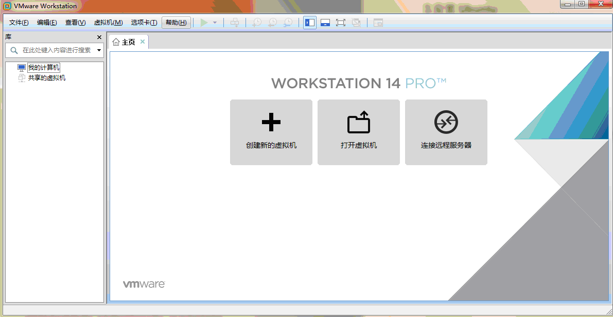

2. 选自定义

   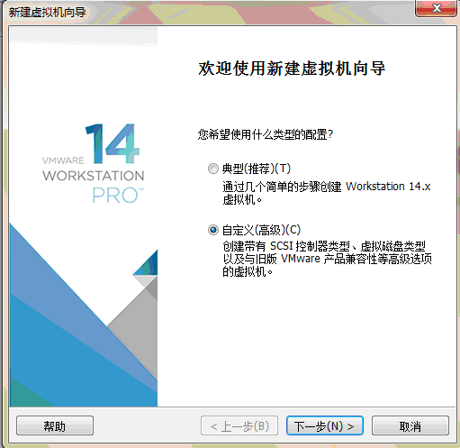

3. 点击下一步，选择稍后安装操作系统

   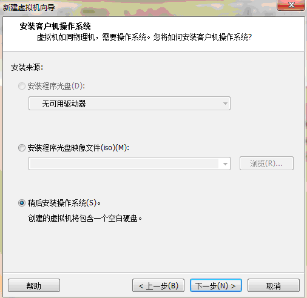

4. 选Linux版本的Ubuntu64位（64位电脑）

   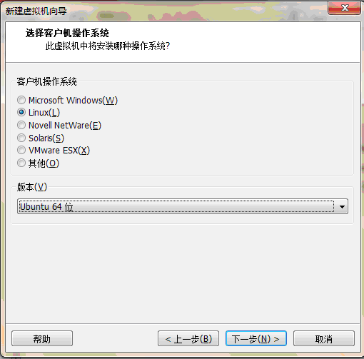

5. 名称和位置自定义

   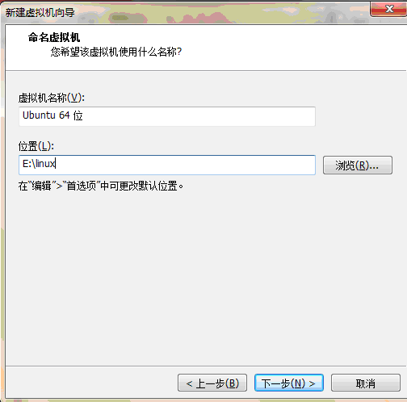

6. 默认两个1

   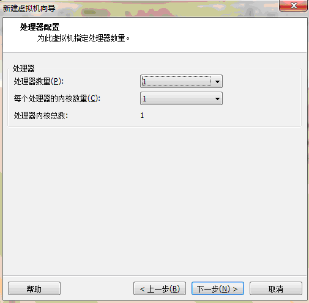

7. 分配内存看自己，电脑内存大可以多分点

   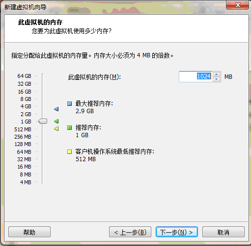

8. 一直点下一步，选择将虚拟磁盘存储为单个文件

   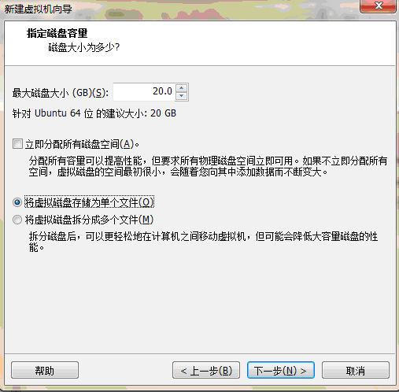

9. 点下一步到此，选择自定义硬件

   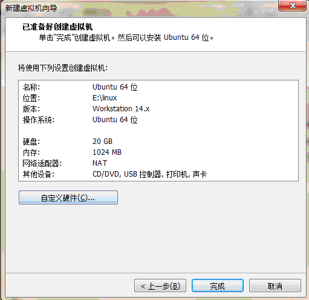

10. 选择新CD/DVD，在右边选择使用iso镜像文件，点浏览到之前下载好的Ubuntu的位置，选择后点完成。

    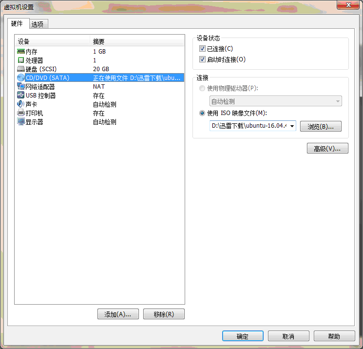

11. 出现如下界面，点击开启此虚拟机

    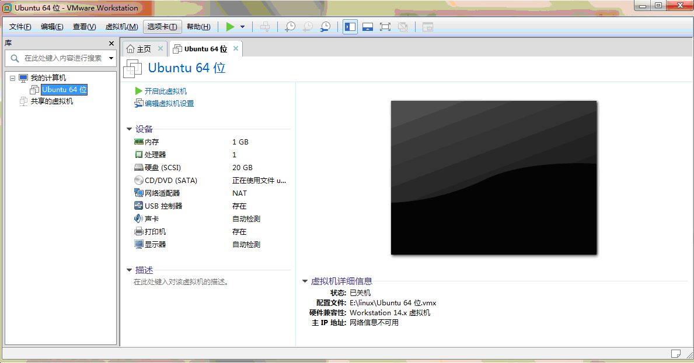

12. 在左侧找到中文，点击安装

    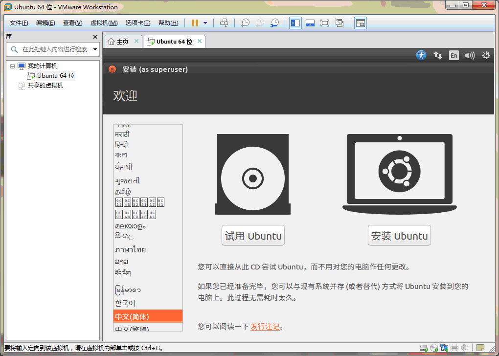

13. 都选下一步

    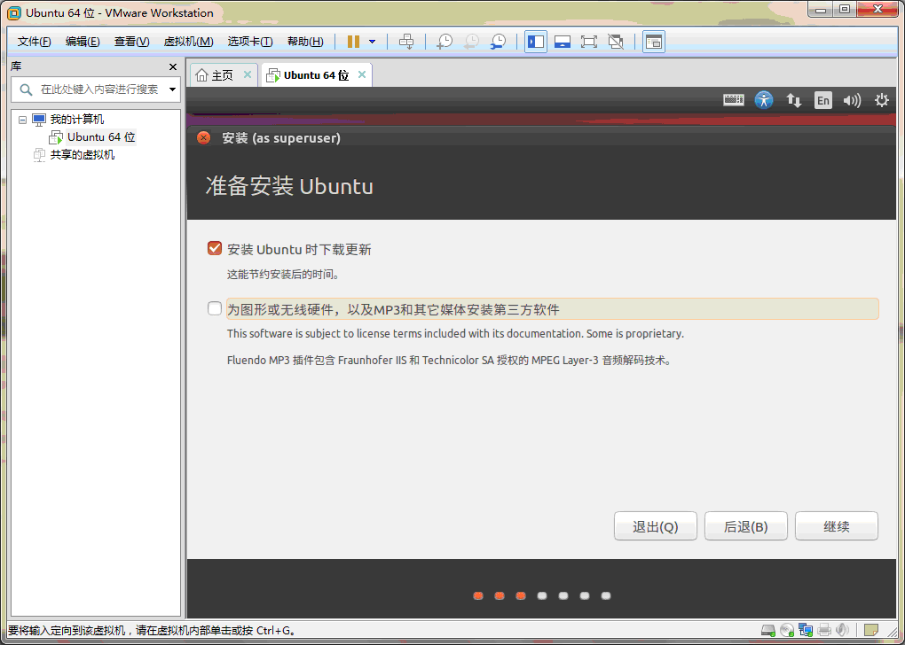

14. 因为是新安装的系统，且在虚拟机中所以可以选择第一个

    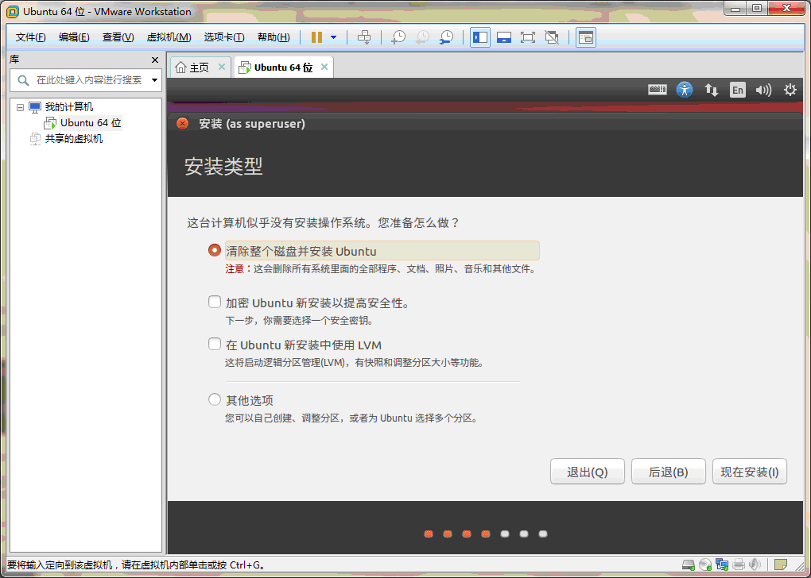

15. 地址默认上海就行，默认汉语

    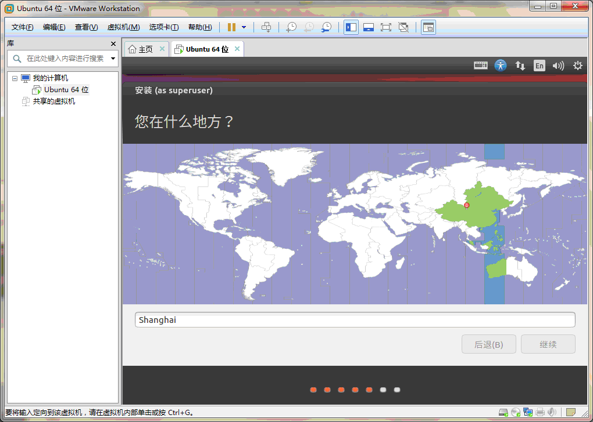

    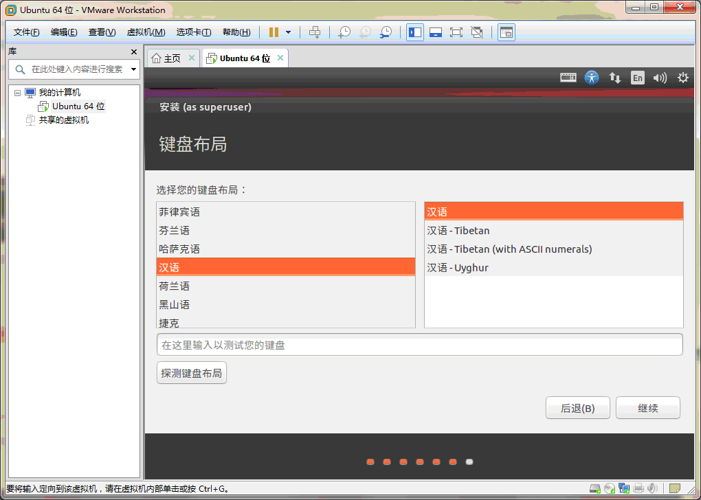

16. 随意填写，然后就安装了

    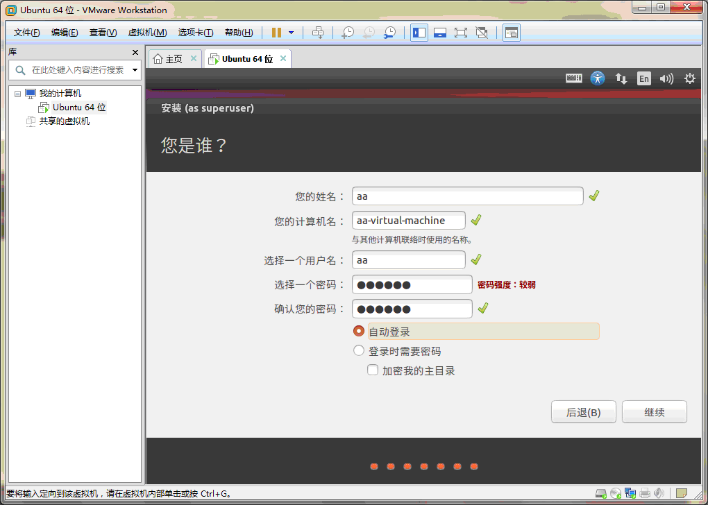

    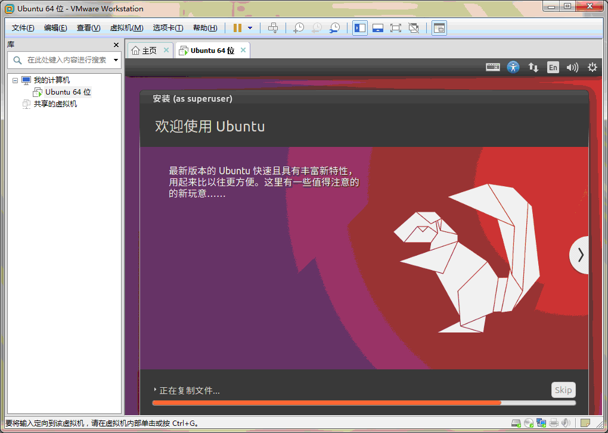

17. 安装完成提示

    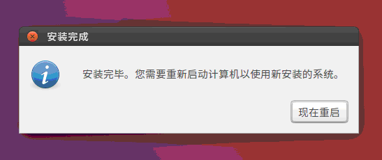

    

    

    

    

    