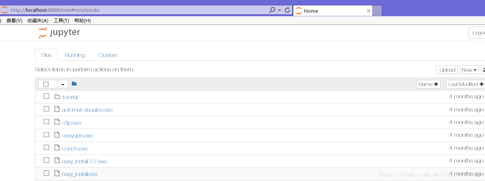

## ipython以及ipython notebook安装和使用

###### 安装

```
pip install IPython
pip install urllib3 （安装IPython Notebook的依赖）
pip install jupyter （安装IPython Notebook）
pip install numpy
pip install matplotlib
pip install pandas
pip install scipy
pip install scikit-learn
```

###### 使用

- ipython的使用：

  ```
  终端直接输入ipython
  ```

  

- ipython notebook的使用

  ```
  终端直接输入ipython notebook
  ```

  

