### opencv,opencv_contrib,cuda编译

> date:2020.08.02
>
> author:liuxiao


#### 一、安装包下载

1. 去github下载[opencv源码](<https://github.com/opencv/opencv>)；
2. 去github下载[opencv_contrib源码](<https://github.com/opencv/opencv_contrib>)；
3. 本人笔记本是GTX1050显卡，装的是cuda10.0，相关[安装教程链接](<https://github.com/lsmilesmile/skills/blob/master/GTX1050CUDA10.0VS2017win10.md>)；
4. cmake安装；
5. vs2017安装；


#### 二、环境安装

##### 1、cmake编译

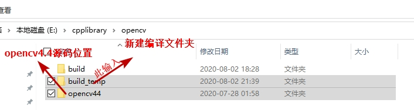

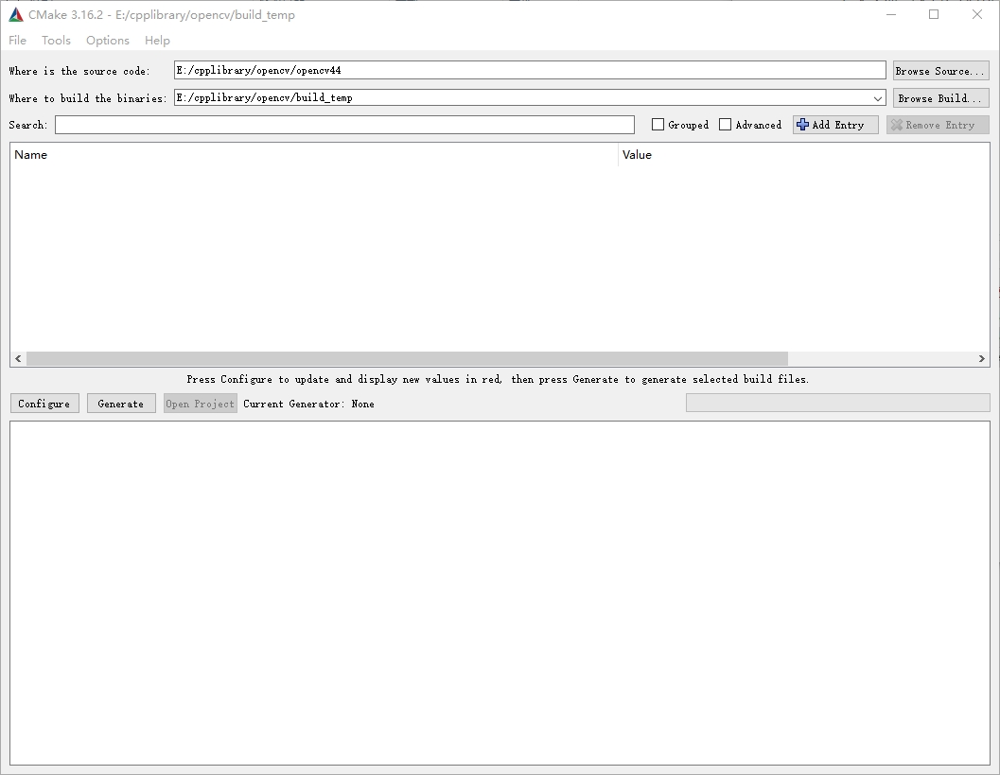

Configure

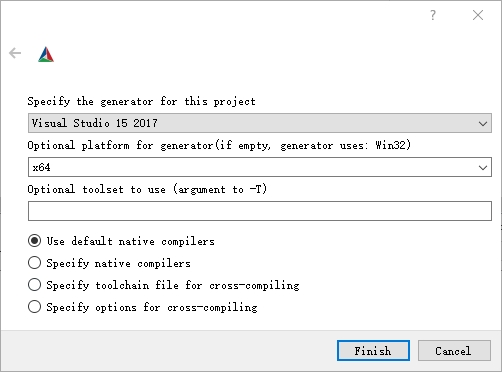

点击Finish

结果：

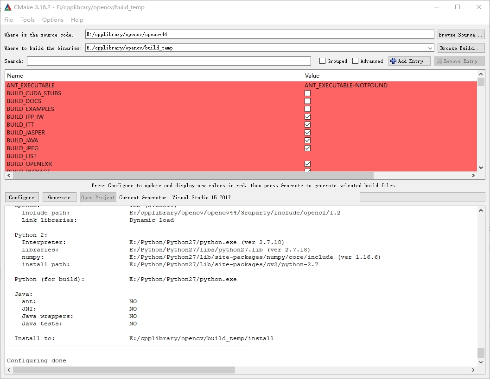

把**CUDA**相关的三个选上

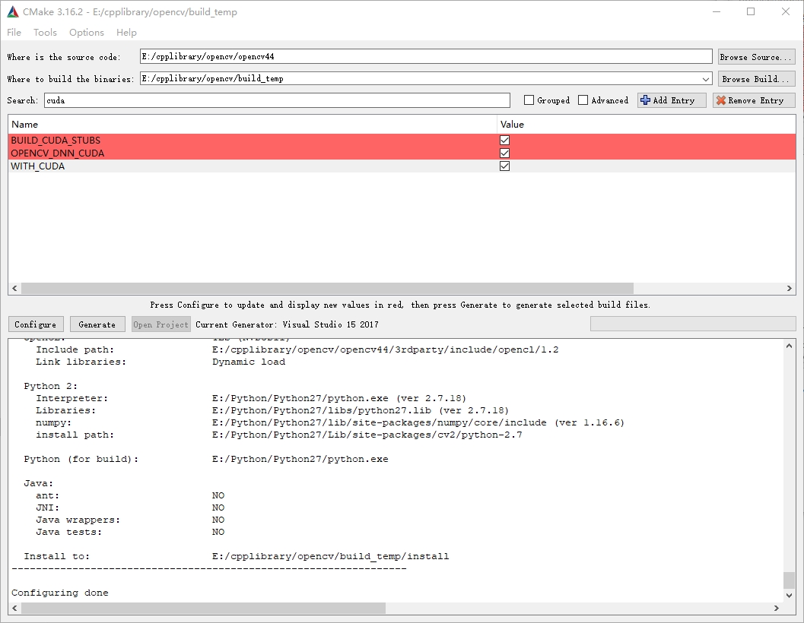

选上**OPENCV_ENABLE_NONFREE**

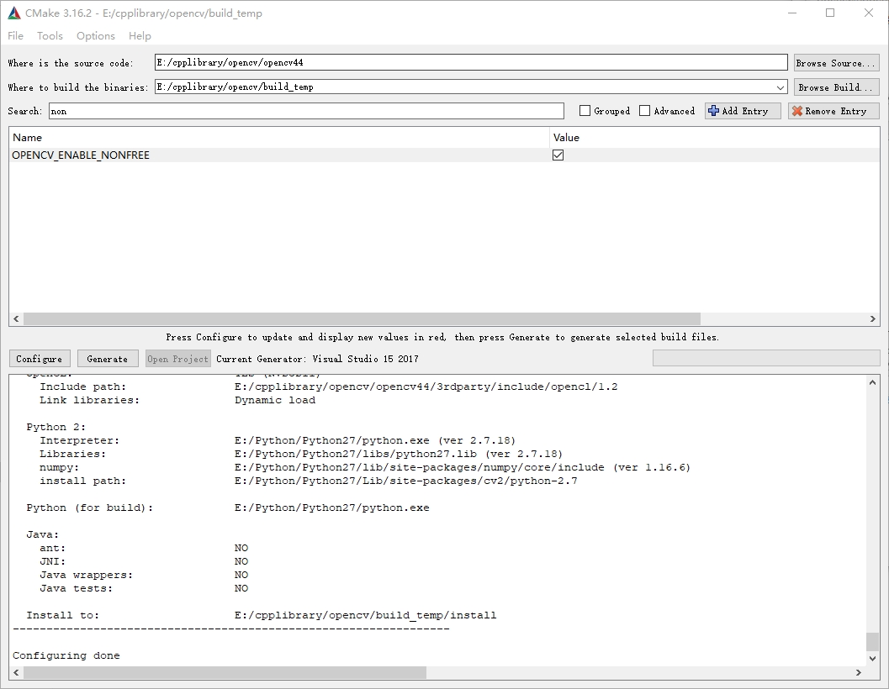

选上**opencv_contrib的modules**文件夹

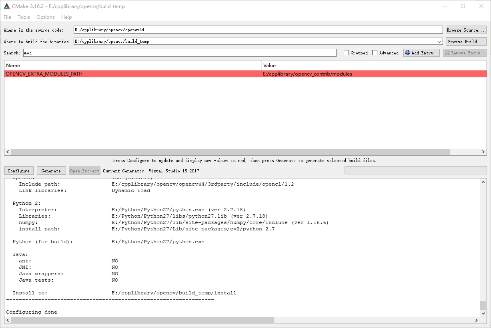

点击Configure

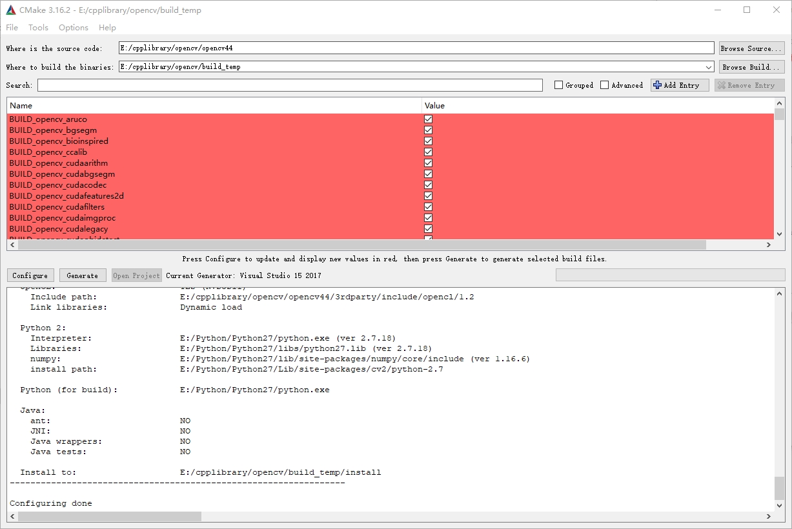

还有红色就继续点击Configure直到没有红色为止

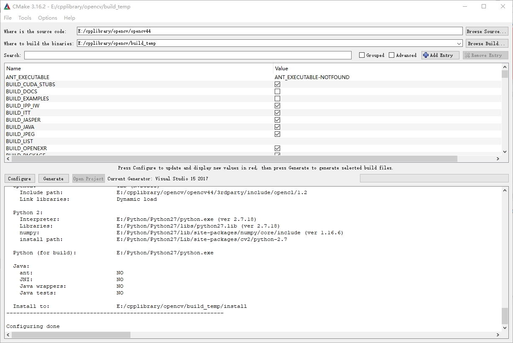

点击Generate

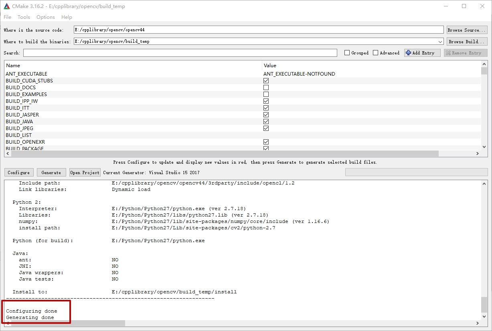

点击**Open Project**，找到**CMakeTargets**下的**ALL_BUILD**右击生成

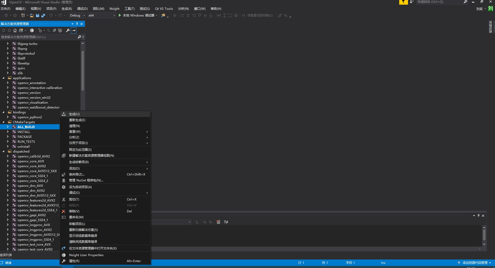

这个要几个小时。。。。。。。。。

完了之后，右击**INSTALL** -> **仅用于项目** -> **仅生成INSTALL(B)**

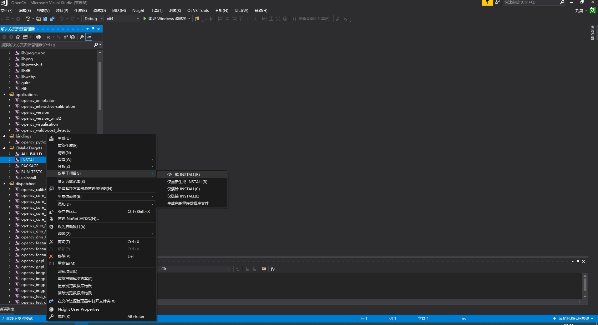

完成！


#### 三、代码测试

包含目录和库目录

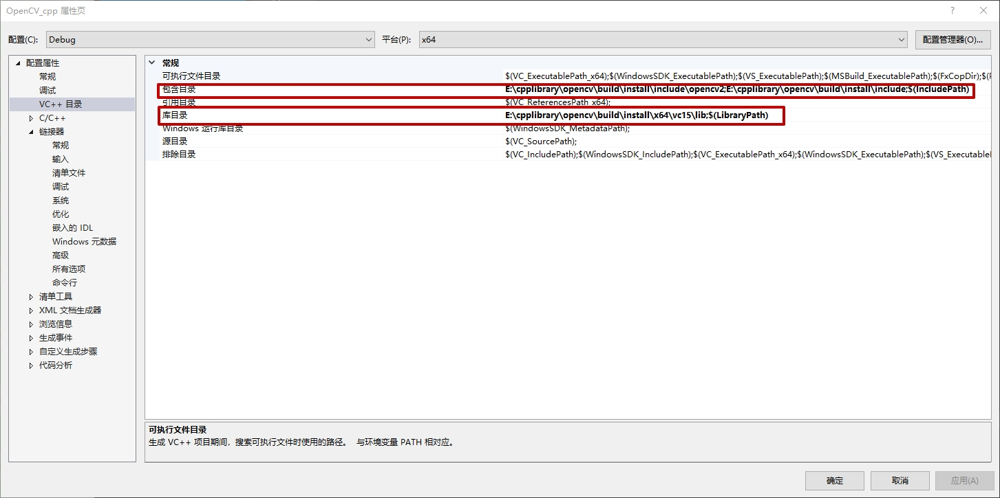

链接器->输入->附加依赖项

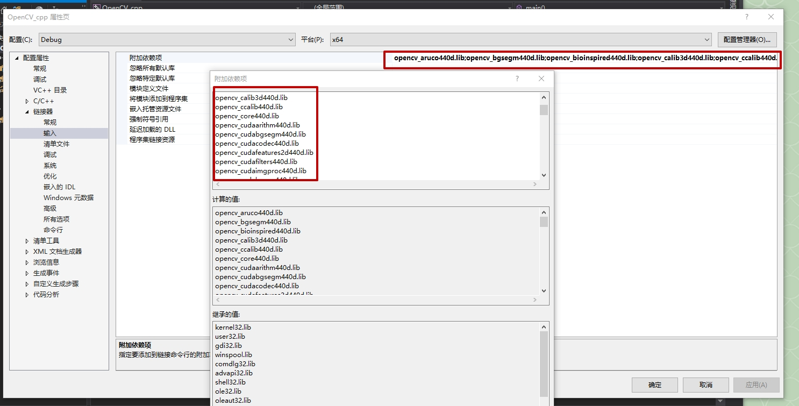

附加依赖项的lib文件在

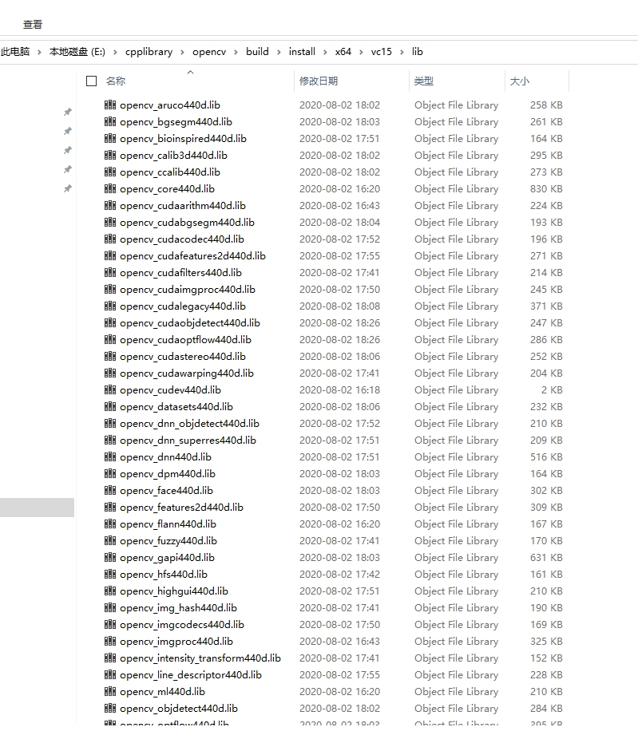

里面的lib文件全部加进去。可以用python打印出来。

代码：

```c++
#include <opencv2/opencv.hpp>
#include <opencv2/cudaimgproc.hpp>
#include <iostream>


int main() {
	cv::cuda::printCudaDeviceInfo(cv::cuda::getDevice());
	int count = cv::cuda::getCudaEnabledDeviceCount();
	printf("GPU Device count %d \ n", count);
	std::cin.get();
	return 0;
}
```

结果：

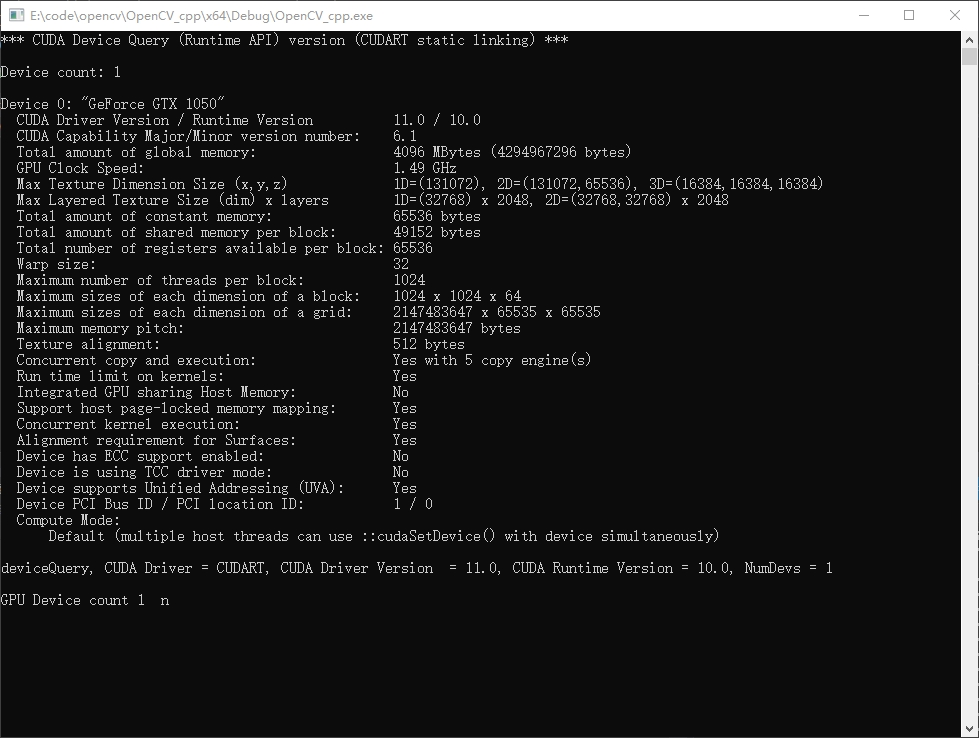

完成！

