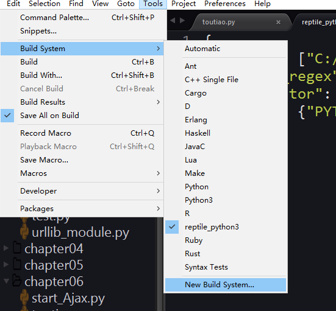
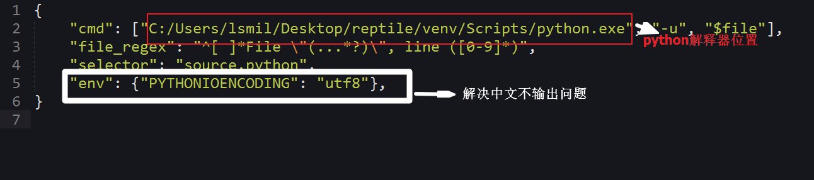

## sublime text3+Python解决无法输出中文问题

如果要使用自己的虚拟环境



在新建的文件中输入

```
{   
    "cmd": ["C:/Users/lsmil/Desktop/reptile/venv/Scripts/python.exe", "-u", "$file"],
    "file_regex": "^[ ]*File \"(...*?)\", line ([0-9]*)",
    "selector": "source.python",
    "env": {"PYTHONIOENCODING": "utf8"},
}
```



## 