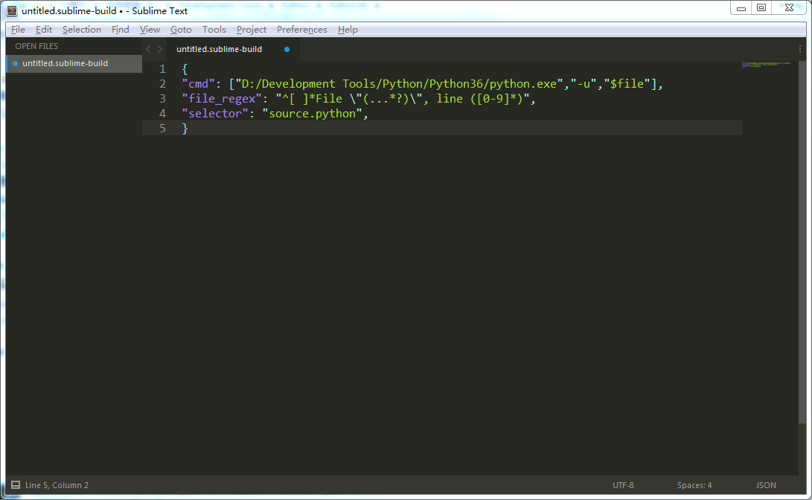
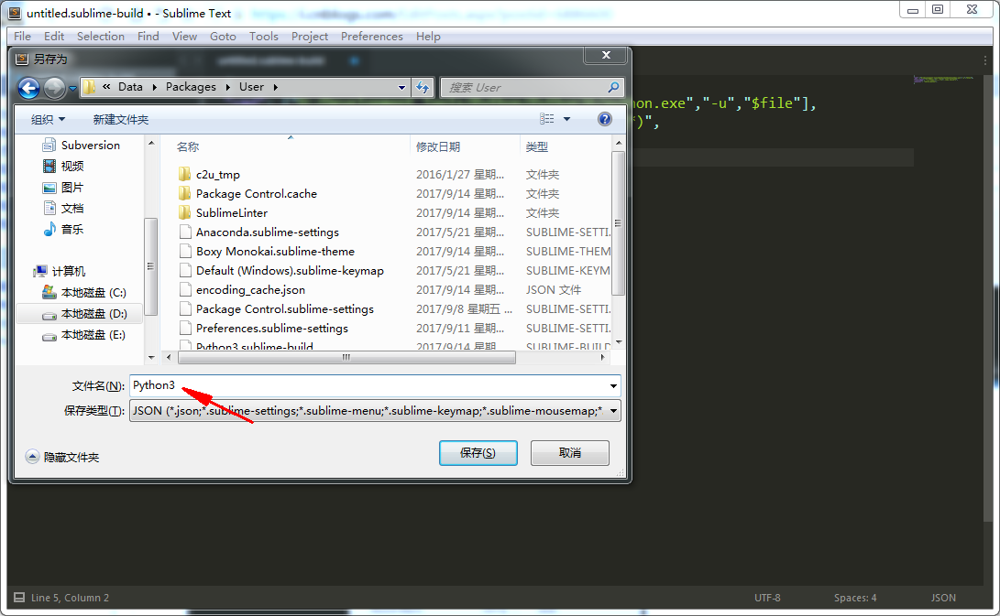

## sublime text3配置Python环境

1. ###### 打开Sublime Text 3，依次进入Tools-->Build System-->New Build System； 

   

2. ###### 打开Sublime Text 3，依次进入Tools-->Build System-->New Build System； 

   

   

3. ###### 注意下图红线处，配置代码需要匹配Python的安装路径（注意区分正反斜杠）； 

   

4. ###### 配置完成后点击保存，可自定义文件名，但一定要使用默认路径，这样配置才能生效； 

   

   

5. ###### 现在，我们重新进入编译环境设置，可以看到刚才添加的Python3编译环境已经出现在候选列表内了，点击勾选就可以切换到Python3编译环境了； 

   

6. ###### 运行(Ctrl+B)一个Python程序测试一下（注意要先保存程序文件，才能正常运行），成功。 

   

7. 配置代码（XXXXXXXXXX代表Python安装路径，比如  D:/Development Tools/Python/python.exe）：

   ```
   {
       "cmd": ["XXXXXXXXXX","-u","$file"],
       "file_regex": "^[ ]*File \"(...*?)\", line ([0-9]*)",
       "selector": "source.python",
   }
   ```

8. [原文链接](https://www.cnblogs.com/zhangqinwei/p/6886600.html)

