## vs2017+dlib19.19+gpu+facedetection

> data:2019.12.21
>
> author:liuxiao


### 一、相关环境安装包下载地址

vs2017以及其他版本[下载地址](https://visualstudio.microsoft.com/zh-hans/vs/older-downloads/);

dlib19.19[下载地址](https://pypi.org/simple/dlib/)，下载下来是个zip文件;

cuda10.0[下载地址](https://developer.nvidia.com/cuda-toolkit-archive)，包括其他版本，我这下载的10.0，其他的版本和vs2017能否成功运行dlib的人脸识别的示例目前还不清楚。

cudnn下载需要先注册登录后才能下载，[cudnn官网](https://developer.nvidia.com/cudnn)，登录后的cudnn[下载地址](https://developer.nvidia.com/rdp/cudnn-archive)，下载与cuda10.0对应版本的cudnn；

cmake[下载地址](https://cmake.org/download/)。


### 二、环境安装

#### 1、vs2017版本更新

之前看相关博客，说vs2017的版本也会影响dlib+gpu的环境配置，于是我把我的vs2017更新一下：

打开vs2017，分别点击帮助-》检查更新，然后更新即可：

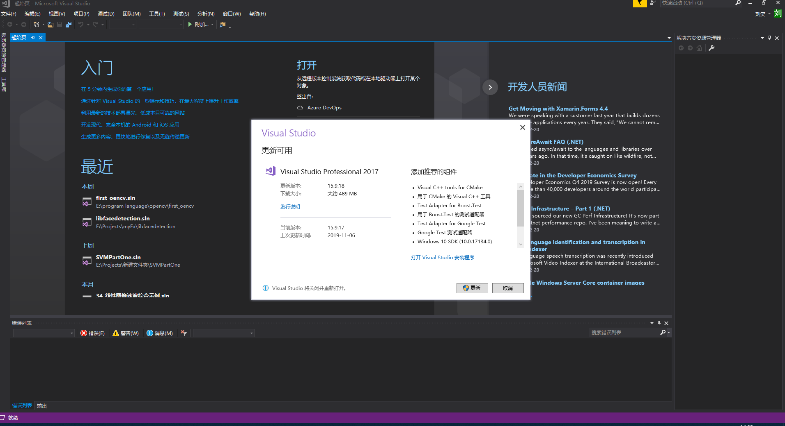

更新后：


2、安装cuda

我选的默认路径：


同意并继续


我选择的是精简，下一步


继续下一步


点击关闭

由于我安装的默认路径，所以将C:\Program Files\NVIDIA Corporation\NVSMI添加到系统环境变量


检查是否安装好，在命令行输入nvcc -V，若出现一下版本信息则表示安装成功：


#### 3、安装cudnn

刚才下载的cudnn是个压缩文件，我在c盘根目录下建一个文件夹，命名位cudnn，解压出来是一个cuda文件夹：


再添加三个环境变量：

```
C:\Program Files\NVIDIA GPU Computing Toolkit\CUDA\v10.0\bin
C:\Program Files\NVIDIA GPU Computing Toolkit\CUDA\v10.0\extras\CUPTI\libx64
C:\cudnn\cuda\bin
```

把下列文件分别按照文件夹放到下面目录：

```
C:\cudnn\cuda\bin\cudnn64_7.dll  放到
C:\Program Files\NVIDIA GPU Computing Toolkit\CUDA\v10.0\bin\
C:\cudnn\cuda\include\cudnn.h    放到
C:\Program Files\NVIDIA GPU Computing Toolkit\CUDA\v10.0\include\
C:\cudnn\cuda\lib\x64\cudnn.lib  放到
C:\Program Files\NVIDIA GPU Computing Toolkit\CUDA\v10.0\lib\x64\
```

至此，cuda和cudnn的环境就配置好了，下面我重启一下。


#### 4、安装cmake

cmake官网[下载地址](https://cmake.org/download/)，自己看着安装就行。


#### 5、编译dlib，将CUDA功能编译进去

- 解压刚刚下载的dlib，为了以后能知道是有cuda库的，我重命名了一下：

  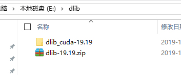

- 打开CMake(cmake-gui)，source code选择E:\dlib\dlib_cuda-19.19\dlib，build the binaries选择E:\dlib\dlib_cuda-19.19\build，build文件夹是我自己新建的，该选项随便选在哪都行应该。

  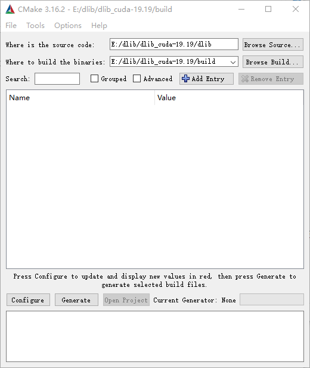

- 点击左下角的configure，会出现一个窗口，前两项选择如下，第三项没选，应该没影响

  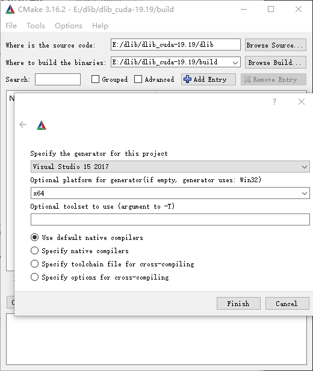

- 点击Finish

  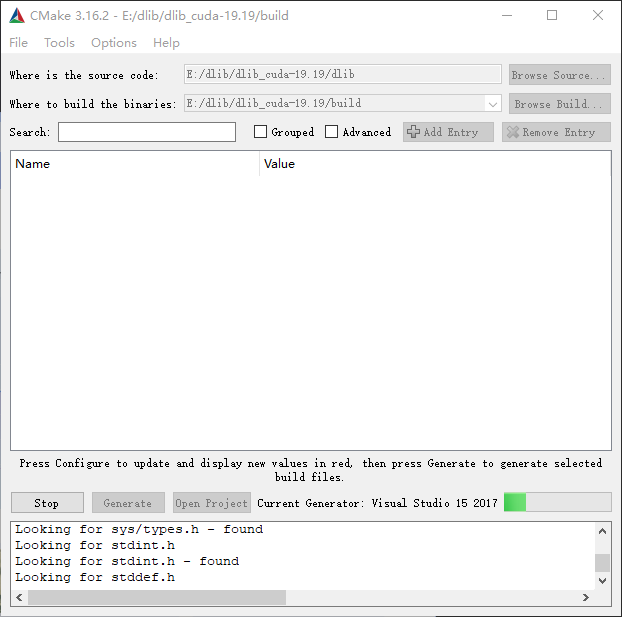

- 过一会出现如下界面

  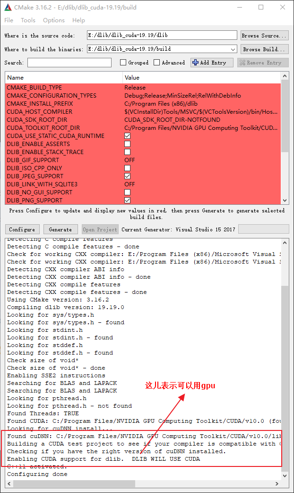

- 在红色的区域找到CMAKE_INSTALL_PREFIX，是lib和include文件生成路径，可以将这两个文件生成路径放在非c盘，防止后面出现权限问题。下面是我新建的存放lib和include生成文件的文件夹路径，并且CMAKE_INSTALL_PREFIX也选择该文件夹

  

  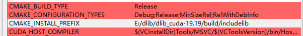

- 红色区域的DLIB_USE_CUDA确保打勾

  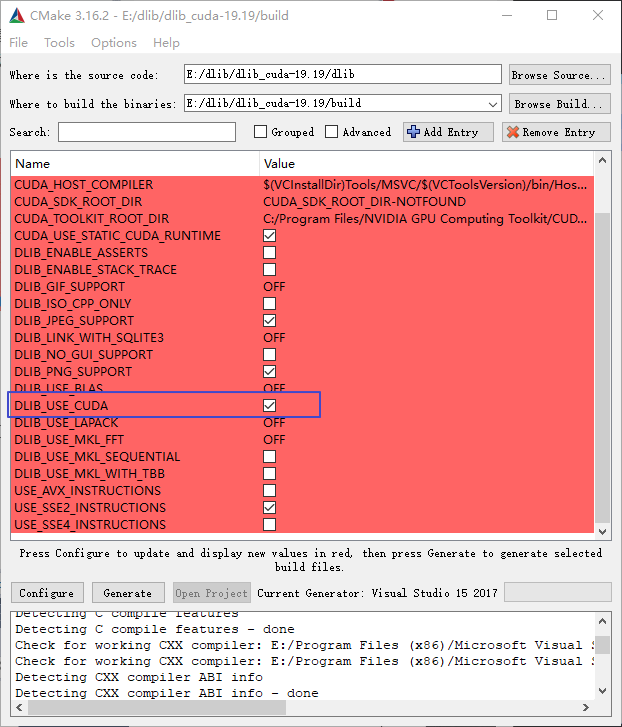

- 点击Generate

  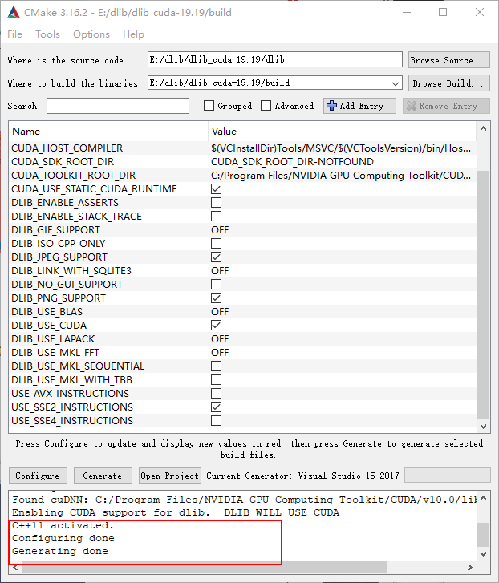

- 完成点击Open Project

  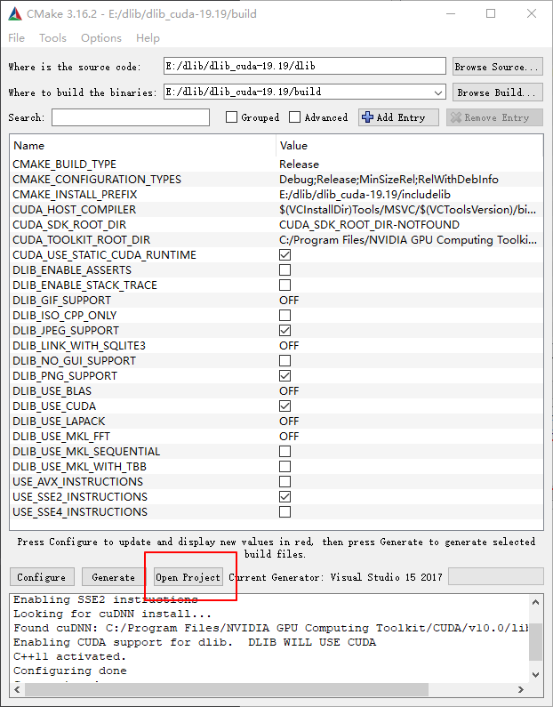

- 右键点击INSTALL，生成（Debug x64）

  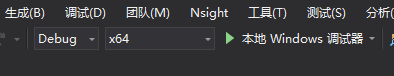

  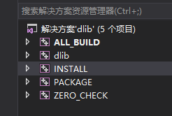

- 输出乱码先不管，影响不大

  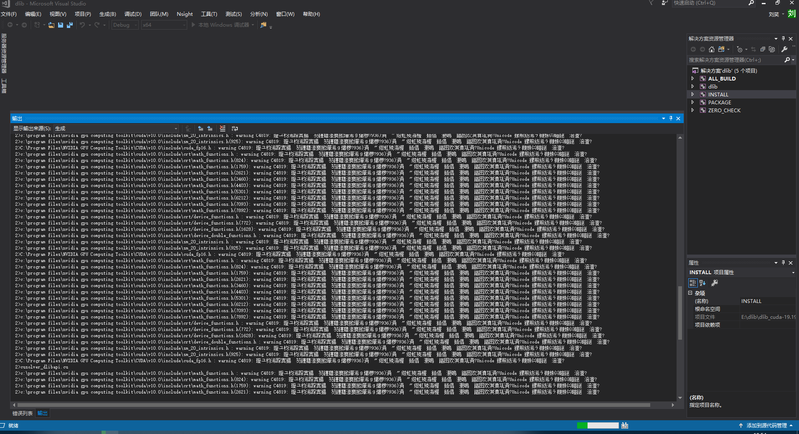

- 最终完成

  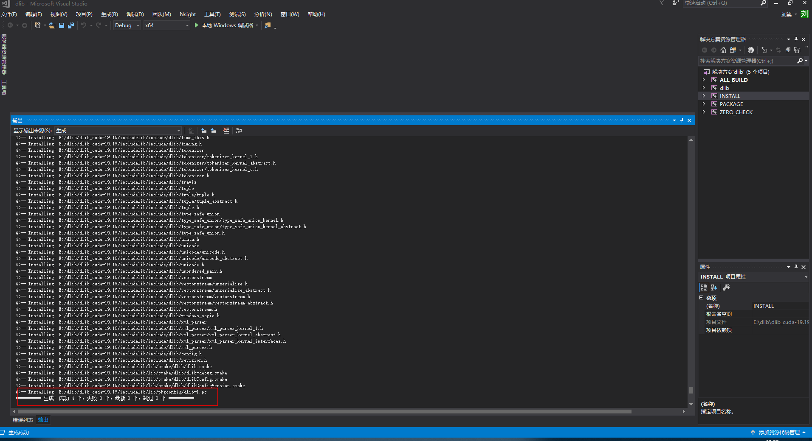

- 这是打开刚才新建的用来存放生成include和lib的文件夹

  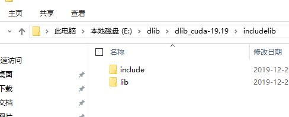


### 三、测试示例代码

#### 1、新建一个c++空项目，配置环境

- 右键项目-》属性-》VC++目录，包含目录和库目录分别设置位刚才生成的include和lib文件夹。

  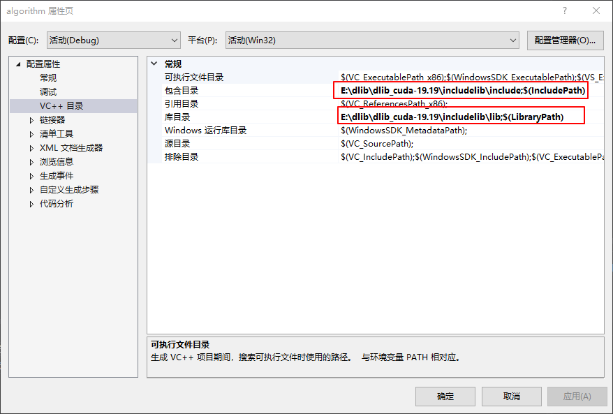

- 设置附加依赖项，链接器-》输入-》附加依赖项，其中dlib19.19.0_debug_64bit_msvc1916.lib就是刚才生成的lib文件夹中的

  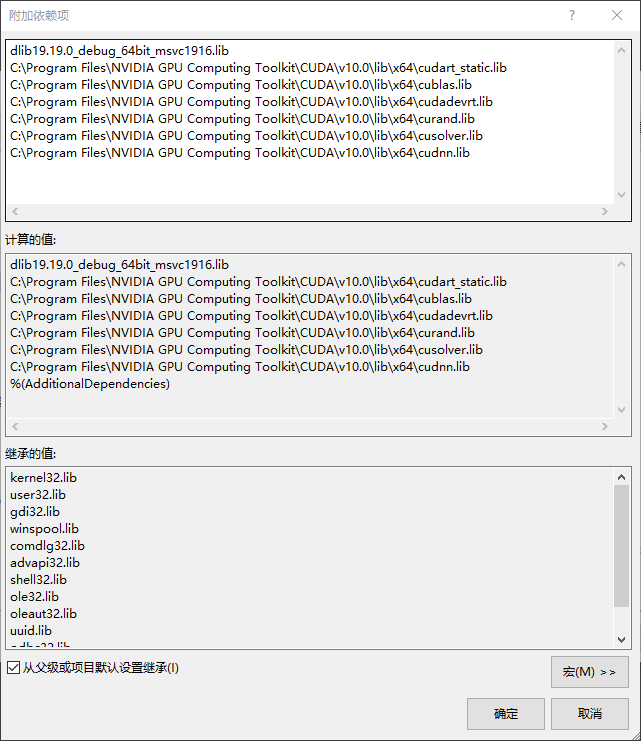

  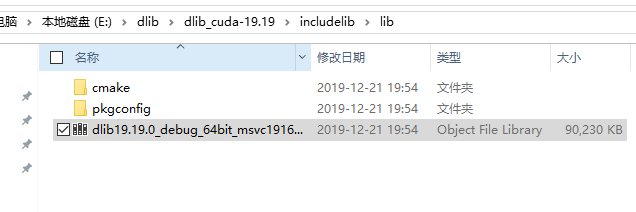

#### 2、代码测试

- 新建dlibfacedetection.cpp

  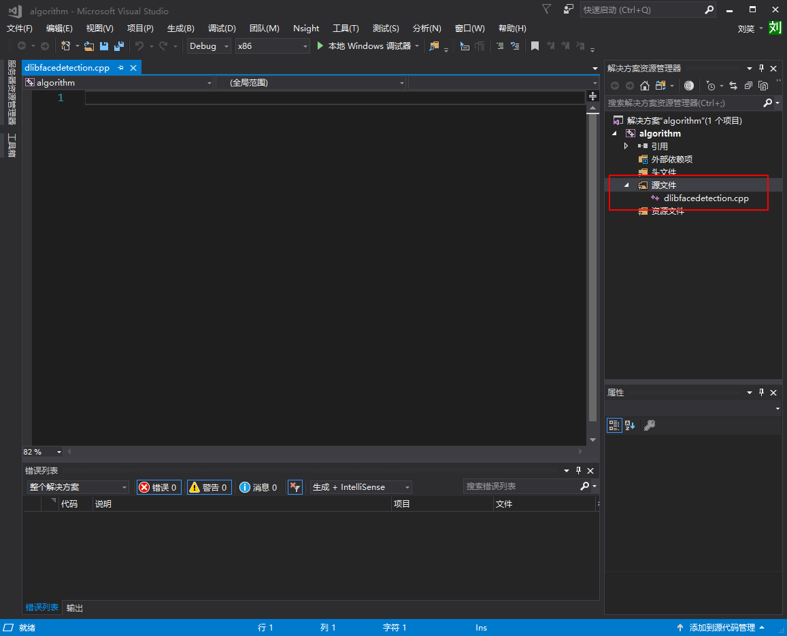

- 在E:\dlib\dlib_cuda-19.19\examples文件夹中找到dnn_face_recognition_ex.cpp代码，将其复制到项目中，去[官网](http://dlib.net/files/)下载需要的模型shape_predictor_5_face_landmarks.dat和dlib_face_recognition_resnet_model_v1.dat，测试图片在E:\dlib\dlib_cuda-19.19\examples\faces，是bald_guys.jpg，下面是我的项目文件夹结构，模型和图片分别放在models和testimgs文件夹中：

  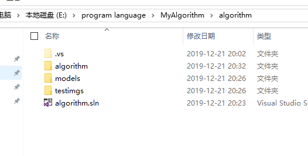

- 运行代码

  ```c++
  // The contents of this file are in the public domain. See LICENSE_FOR_EXAMPLE_PROGRAMS.txt
  /*
  	This is an example illustrating the use of the deep learning tools from the dlib C++
  	Library.  In it, we will show how to do face recognition.  This example uses the
  	pretrained dlib_face_recognition_resnet_model_v1 model which is freely available from
  	the dlib web site.  This model has a 99.38% accuracy on the standard LFW face
  	recognition benchmark, which is comparable to other state-of-the-art methods for face
  	recognition as of February 2017.
  
  	In this example, we will use dlib to do face clustering.  Included in the examples
  	folder is an image, bald_guys.jpg, which contains a bunch of photos of action movie
  	stars Vin Diesel, The Rock, Jason Statham, and Bruce Willis.   We will use dlib to
  	automatically find their faces in the image and then to automatically determine how
  	many people there are (4 in this case) as well as which faces belong to each person.
  
  	Finally, this example uses a network with the loss_metric loss.  Therefore, if you want
  	to learn how to train your own models, or to get a general introduction to this loss
  	layer, you should read the dnn_metric_learning_ex.cpp and
  	dnn_metric_learning_on_images_ex.cpp examples.
  */
  
  #include <dlib/dnn.h>
  #include <dlib/gui_widgets.h>
  #include <dlib/clustering.h>
  #include <dlib/string.h>
  #include <dlib/image_io.h>
  #include <dlib/image_processing/frontal_face_detector.h>
  
  using namespace dlib;
  using namespace std;
  
  // ----------------------------------------------------------------------------------------
  
  // The next bit of code defines a ResNet network.  It's basically copied
  // and pasted from the dnn_imagenet_ex.cpp example, except we replaced the loss
  // layer with loss_metric and made the network somewhat smaller.  Go read the introductory
  // dlib DNN examples to learn what all this stuff means.
  //
  // Also, the dnn_metric_learning_on_images_ex.cpp example shows how to train this network.
  // The dlib_face_recognition_resnet_model_v1 model used by this example was trained using
  // essentially the code shown in dnn_metric_learning_on_images_ex.cpp except the
  // mini-batches were made larger (35x15 instead of 5x5), the iterations without progress
  // was set to 10000, and the training dataset consisted of about 3 million images instead of
  // 55.  Also, the input layer was locked to images of size 150.
  template <template <int, template<typename>class, int, typename> class block, int N, template<typename>class BN, typename SUBNET>
  using residual = add_prev1<block<N, BN, 1, tag1<SUBNET>>>;
  
  template <template <int, template<typename>class, int, typename> class block, int N, template<typename>class BN, typename SUBNET>
  using residual_down = add_prev2<avg_pool<2, 2, 2, 2, skip1<tag2<block<N, BN, 2, tag1<SUBNET>>>>>>;
  
  template <int N, template <typename> class BN, int stride, typename SUBNET>
  using block = BN<con<N, 3, 3, 1, 1, relu<BN<con<N, 3, 3, stride, stride, SUBNET>>>>>;
  
  template <int N, typename SUBNET> using ares = relu<residual<block, N, affine, SUBNET>>;
  template <int N, typename SUBNET> using ares_down = relu<residual_down<block, N, affine, SUBNET>>;
  
  template <typename SUBNET> using alevel0 = ares_down<256, SUBNET>;
  template <typename SUBNET> using alevel1 = ares<256, ares<256, ares_down<256, SUBNET>>>;
  template <typename SUBNET> using alevel2 = ares<128, ares<128, ares_down<128, SUBNET>>>;
  template <typename SUBNET> using alevel3 = ares<64, ares<64, ares<64, ares_down<64, SUBNET>>>>;
  template <typename SUBNET> using alevel4 = ares<32, ares<32, ares<32, SUBNET>>>;
  
  using anet_type = loss_metric<fc_no_bias<128, avg_pool_everything<
  	alevel0<
  	alevel1<
  	alevel2<
  	alevel3<
  	alevel4<
  	max_pool<3, 3, 2, 2, relu<affine<con<32, 7, 7, 2, 2,
  	input_rgb_image_sized<150>
  	>>>>>>>>>>>>;
  
  // ----------------------------------------------------------------------------------------
  
  std::vector<matrix<rgb_pixel>> jitter_image(
  	const matrix<rgb_pixel>& img
  );
  
  // ----------------------------------------------------------------------------------------
  
  int main(int argc, char** argv) try
  {
  	/*if (argc != 2)
  	{
  		cout << "Run this example by invoking it like this: " << endl;
  		cout << "   ./dnn_face_recognition_ex faces/bald_guys.jpg" << endl;
  		cout << endl;
  		cout << "You will also need to get the face landmarking model file as well as " << endl;
  		cout << "the face recognition model file.  Download and then decompress these files from: " << endl;
  		cout << "http://dlib.net/files/shape_predictor_5_face_landmarks.dat.bz2" << endl;
  		cout << "http://dlib.net/files/dlib_face_recognition_resnet_model_v1.dat.bz2" << endl;
  		cout << endl;
  		return 1;
  	}*/
  
  	// The first thing we are going to do is load all our models.  First, since we need to
  	// find faces in the image we will need a face detector:
  	frontal_face_detector detector = get_frontal_face_detector();
  	// We will also use a face landmarking model to align faces to a standard pose:  (see face_landmark_detection_ex.cpp for an introduction)
  	shape_predictor sp;
  	deserialize("E:\\programlanguage\\MyAlgorithm\\algorithm\\models\\shape_predictor_5_face_landmarks.dat") >> sp;
  	// And finally we load the DNN responsible for face recognition.
  	anet_type net;
  	deserialize("E:\\programlanguage\\MyAlgorithm\\algorithm\\models\\dlib_face_recognition_resnet_model_v1.dat") >> net;
  
  	matrix<rgb_pixel> img;
  	load_image(img, argv[1]);
  	// Display the raw image on the screen
  	image_window win(img);
  
  	// Run the face detector on the image of our action heroes, and for each face extract a
  	// copy that has been normalized to 150x150 pixels in size and appropriately rotated
  	// and centered.
  	std::vector<matrix<rgb_pixel>> faces;
  	for (auto face : detector(img))
  	{
  		auto shape = sp(img, face);
  		matrix<rgb_pixel> face_chip;
  		extract_image_chip(img, get_face_chip_details(shape, 150, 0.25), face_chip);
  		faces.push_back(move(face_chip));
  		// Also put some boxes on the faces so we can see that the detector is finding
  		// them.
  		win.add_overlay(face);
  	}
  
  	if (faces.size() == 0)
  	{
  		cout << "No faces found in image!" << endl;
  		return 1;
  	}
  
  	// This call asks the DNN to convert each face image in faces into a 128D vector.
  	// In this 128D vector space, images from the same person will be close to each other
  	// but vectors from different people will be far apart.  So we can use these vectors to
  	// identify if a pair of images are from the same person or from different people.  
  	std::vector<matrix<float, 0, 1>> face_descriptors = net(faces);
  
  
  	// In particular, one simple thing we can do is face clustering.  This next bit of code
  	// creates a graph of connected faces and then uses the Chinese whispers graph clustering
  	// algorithm to identify how many people there are and which faces belong to whom.
  	std::vector<sample_pair> edges;
  	for (size_t i = 0; i < face_descriptors.size(); ++i)
  	{
  		for (size_t j = i; j < face_descriptors.size(); ++j)
  		{
  			// Faces are connected in the graph if they are close enough.  Here we check if
  			// the distance between two face descriptors is less than 0.6, which is the
  			// decision threshold the network was trained to use.  Although you can
  			// certainly use any other threshold you find useful.
  			if (length(face_descriptors[i] - face_descriptors[j]) < 0.6)
  				edges.push_back(sample_pair(i, j));
  		}
  	}
  	std::vector<unsigned long> labels;
  	const auto num_clusters = chinese_whispers(edges, labels);
  	// This will correctly indicate that there are 4 people in the image.
  	cout << "number of people found in the image: " << num_clusters << endl;
  
  
  	// Now let's display the face clustering results on the screen.  You will see that it
  	// correctly grouped all the faces. 
  	std::vector<image_window> win_clusters(num_clusters);
  	for (size_t cluster_id = 0; cluster_id < num_clusters; ++cluster_id)
  	{
  		std::vector<matrix<rgb_pixel>> temp;
  		for (size_t j = 0; j < labels.size(); ++j)
  		{
  			if (cluster_id == labels[j])
  				temp.push_back(faces[j]);
  		}
  		win_clusters[cluster_id].set_title("face cluster " + cast_to_string(cluster_id));
  		win_clusters[cluster_id].set_image(tile_images(temp));
  	}
  
  
  
  
  	// Finally, let's print one of the face descriptors to the screen.  
  	cout << "face descriptor for one face: " << trans(face_descriptors[0]) << endl;
  
  	// It should also be noted that face recognition accuracy can be improved if jittering
  	// is used when creating face descriptors.  In particular, to get 99.38% on the LFW
  	// benchmark you need to use the jitter_image() routine to compute the descriptors,
  	// like so:
  	matrix<float, 0, 1> face_descriptor = mean(mat(net(jitter_image(faces[0]))));
  	cout << "jittered face descriptor for one face: " << trans(face_descriptor) << endl;
  	// If you use the model without jittering, as we did when clustering the bald guys, it
  	// gets an accuracy of 99.13% on the LFW benchmark.  So jittering makes the whole
  	// procedure a little more accurate but makes face descriptor calculation slower.
  
  
  	cout << "hit enter to terminate" << endl;
  	cin.get();
  }
  catch (std::exception& e)
  {
  	cout << e.what() << endl;
  }
  
  // ----------------------------------------------------------------------------------------
  
  std::vector<matrix<rgb_pixel>> jitter_image(
  	const matrix<rgb_pixel>& img
  )
  {
  	// All this function does is make 100 copies of img, all slightly jittered by being
  	// zoomed, rotated, and translated a little bit differently. They are also randomly
  	// mirrored left to right.
  	thread_local dlib::rand rnd;
  
  	std::vector<matrix<rgb_pixel>> crops;
  	for (int i = 0; i < 100; ++i)
  		crops.push_back(jitter_image(img, rnd));
  
  	return crops;
  }
  
  // --------------------------------------------------------------------------------------
  ```

  我将下面的代码注释掉了，不然运行不出来。。。。。。。。。。。。。。。。

  ```c++
  if (argc != 2)
  	{
  		cout << "Run this example by invoking it like this: " << endl;
  		cout << "   ./dnn_face_recognition_ex faces/bald_guys.jpg" << endl;
  		cout << endl;
  		cout << "You will also need to get the face landmarking model file as well as " << endl;
  		cout << "the face recognition model file.  Download and then decompress these files from: " << endl;
  		cout << "http://dlib.net/files/shape_predictor_5_face_landmarks.dat.bz2" << endl;
  		cout << "http://dlib.net/files/dlib_face_recognition_resnet_model_v1.dat.bz2" << endl;
  		cout << endl;
  		return 1;
  	}
  ```

  

- 然后在命令行运行如下命令

  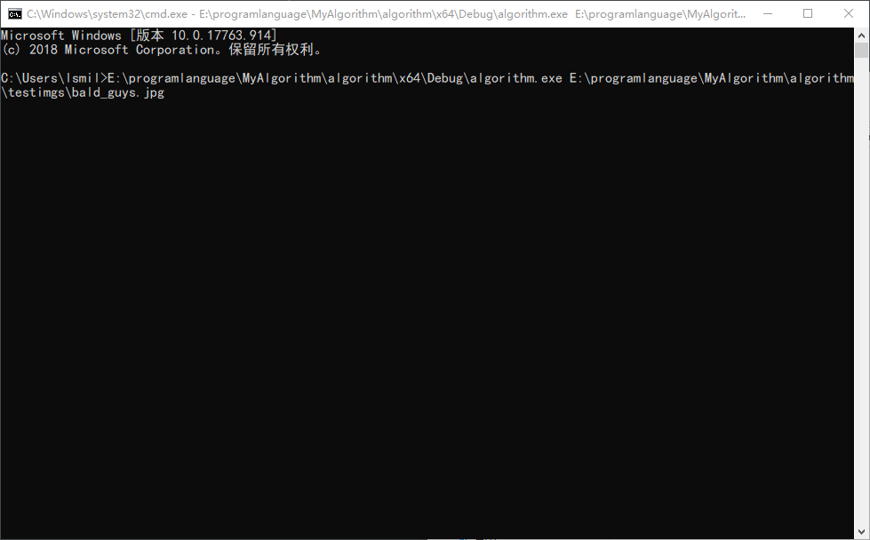

- 这是出现如下错误

  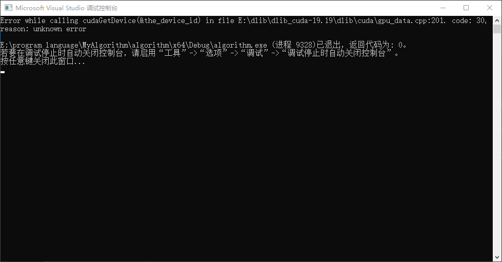

  这个意思应该是cuda调用失败，好像没找到，往上查了一下，好像是刚才装了cuda后显卡驱动没装。于是我查看电脑是否有显卡驱动。

- 右键我的电脑-》属性-》设备管理器-》显示适配器

  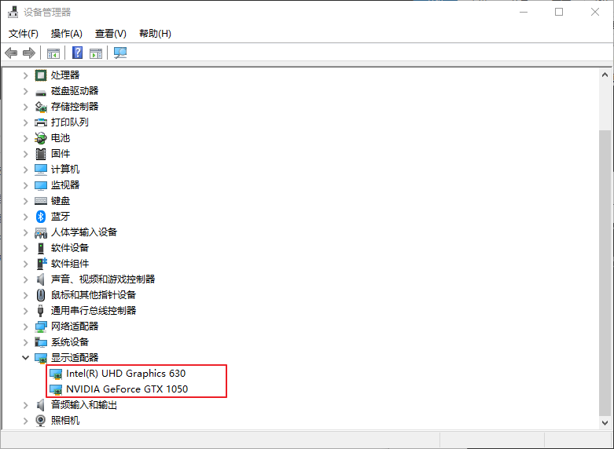

  第一个是集成显卡，第二个是独立显卡，这个图是安装了驱动了的，没安装驱动之前，独立显卡图标上是个黄色感叹号，上网搜了一下，说这个情况是驱动没装，于是我装 了下驱动：

- 进入[官网](<https://www.nvidia.cn/>)，选择驱动程序下拉菜单中的GEFORCE驱动程序

  

- 在手动搜索驱动程序中找到对应的驱动

  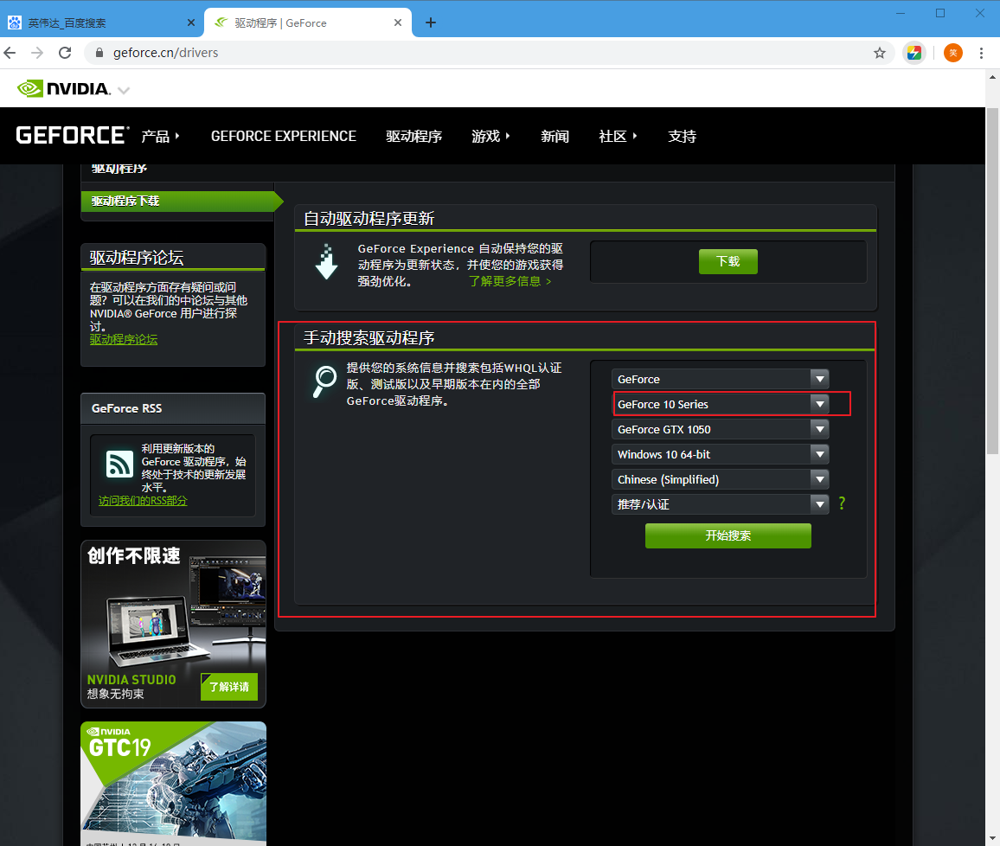

- 下载安装后问题解决，重新在命令行运行代码，成功了：

  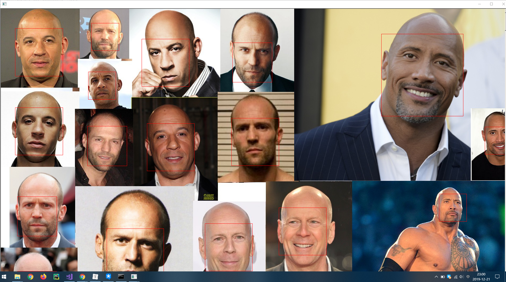

  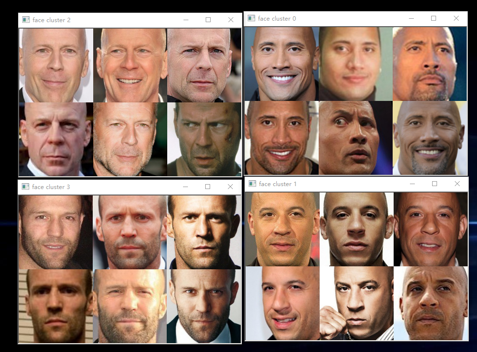

