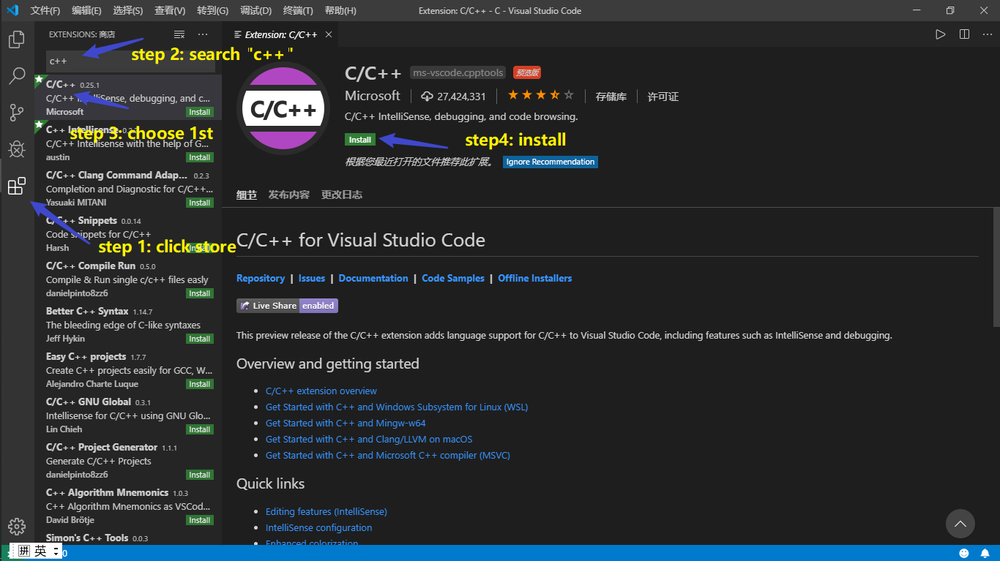
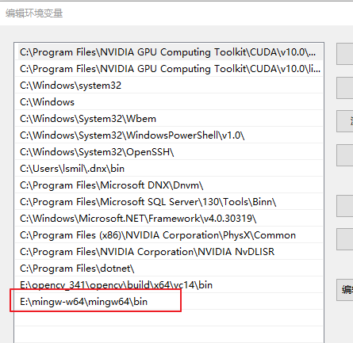
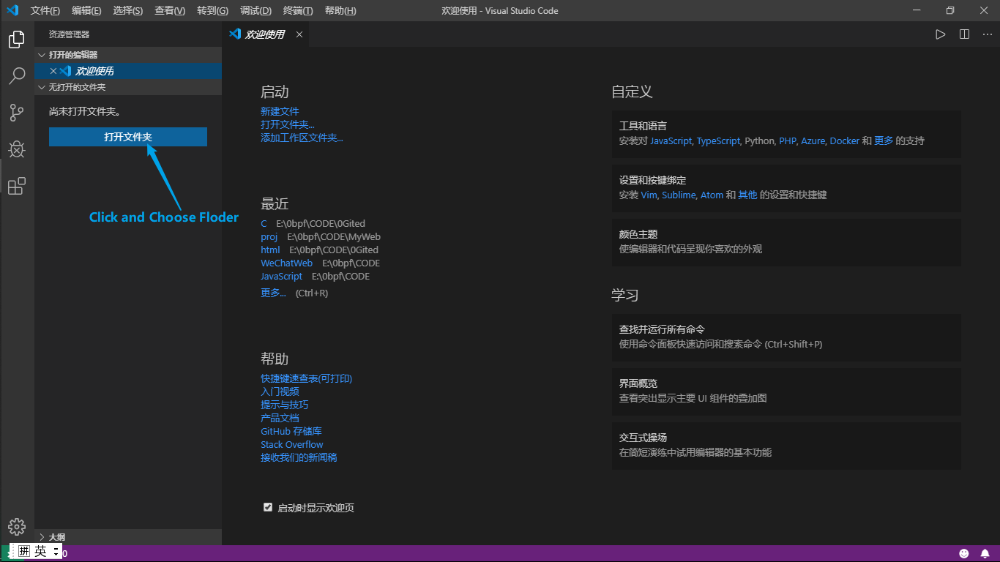
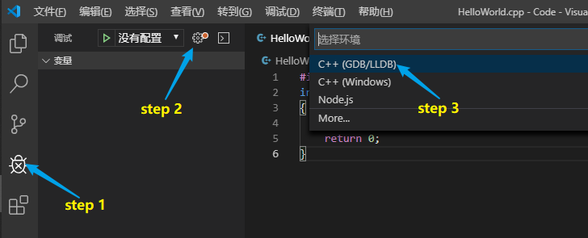
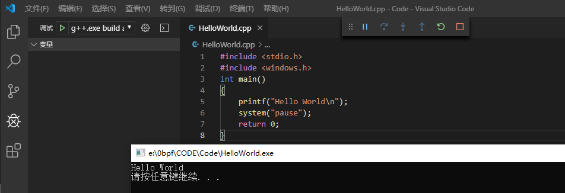

#### vscode配置c++运行环境

##### 步骤

- 下载VScode
- vscode中安装cpptools
- 下载MinGW
- 配置环境变量
- 编写cpp文件配置C++环境
- 测试


##### 1、下载安装VScode

[vscode下载链接](https://code.visualstudio.com/Download)，一直下一步安装就行。


##### 2、安装cpptools工具




##### 3、下载MinGW

下载地址：[MinGW](https://sourceforge.net/projects/mingw-w64/files/)

往下拉网页


不知道是不是网络原因，在线版安装时一直在在线下载相关文件，于是我直接用迅雷下载了离线版，好像是个压缩包，解压到你想存放的路径即可


##### 配置环境变量



配置好后重启vscode

按下 win + R，输入cmd，回车键之后输入g++，再回车，如果提示以下信息[1]，则环境变量配置成功。如果提示以下信息[2]，则环境变量配置失败。

```
[1]：g++: fatal error: no input files
[2]：'g++' 不是内部或外部命令，也不是可运行的程序或批处理文件。
```


##### 5、编写cpp文件配置c++环境

1. 新建空文件夹MyCode

2. 打开VScode，打开Code文件夹

   

3. 新建test.cpp文件

   ```c++
   #include <stdio.h>
   #include <windows.h>
   int main()
   {
       printf("Hello World\n");
       system("pause");
       return 0;
   }
   ```

4. 进入调试界面添加配置环境，选择 C++(GDB/LLDB)，再选择 g++.exe，之后会自动生成 launch.json 配置文件

   

5. 编辑 launch.json 配置文件

   ```json
    1 {
    2     "version": "0.2.0",
    3     "configurations": [
    4         {
    5             "name": "g++.exe build and debug active file",
    6             "type": "cppdbg",
    7             "request": "launch",
    8             "program": "${fileDirname}\\${fileBasenameNoExtension}.exe",
    9             "args": [],
   10             "stopAtEntry": false,
   11             "cwd": "${workspaceFolder}",
   12             "environment": [],
   13             "externalConsole": true,      //修改此项，让其弹出终端
   14             "MIMode": "gdb",
   15             "miDebuggerPath": "D:\\2Software\\mingw64\\bin\\gdb.exe",
   16             "setupCommands": [
   17                 {
   18                     "description": "Enable pretty-printing for gdb",
   19                     "text": "-enable-pretty-printing",
   20                     "ignoreFailures": true
   21                 }
   22             ],
   23             "preLaunchTask": "task g++" //修改此项
   24         }
   25     ]
   26 }
   ```

   

6. 返回.cpp文件，按F5进行调试，会弹出找不到任务"task g++"，选择 "配置任务"，会自动生成 tasks.json 文件

7. 编辑 tasks.json 文件

   ```json
   1 {
    2     "version": "2.0.0",
    3     "tasks": [
    4         {
    5             "type": "shell",
    6             "label": "task g++",    //修改此项
    7             "command": "D:\\2Software\\mingw64\\bin\\g++.exe",
    8             "args": [
    9                 "-g",
   10                 "${file}",
   11                 "-o",
   12                 "${fileDirname}\\${fileBasenameNoExtension}.exe"
   13             ],
   14             "options": {
   15                 "cwd": "D:\\2Software\\mingw64\\bin"
   16             },
   17             "problemMatcher": [
   18                 "$gcc"
   19             ],
   20             "group": "build"
   21         }
   22     ]
   23 }
   ```

   【注】： launch.json 文件中 "preLaunchTask" 的值 必须与 tasks.json 文件中 "label"的值一致。值的设置看个人喜好，保持默认也是OK的。

8. 运行

   按F5调试

   

   


