# SKILLS

> [TOC]
>
> 


#### **sublime使用方法**

```
插件安装：首先安装插件管理器（package control）
安装插件：ctrl+shift+p
imesupport  解决光标跟随问题
anaconda    python智能提示工具
emmet       html快速插件

【注】sublime安装完毕之后，默认会自动关联python的可执行程序，如果没有自动关联，点击tools里面的build system，手动选择python，如果还不行，自己按照固定的格式新建一个build system即可
```

#### **sublime text3安装package control**

view –> show console –> 输入：

```
import urllib.request,os; pf = 'Package Control.sublime-package'; ipp = sublime.installed_packages_path(); urllib.request.install_opener( urllib.request.build_opener( urllib.request.ProxyHandler()) ); open(os.path.join(ipp, pf), 'wb').write(urllib.request.urlopen( 'http://sublime.wbond.net/' + pf.replace(' ','%20')).read())
```

#### **sublime text3解决鼠标跟随问题**

```
Ctrl + Shift + p --> 安装IMESupport
```

#### **sublime text3安装代码提示插件**

```
Ctrl + Shift + p --> 安装Anaconda
```

#### **sublime text3设置快捷键**

```
Preference --> Settings - User
{ 
	"keys": ["ctrl+shift+p"], 
	"command": "cancel_build" 
}
```

#### **sublime text3设置Tab缩进为4空格**

```
1. 菜单栏里点击 Preferences-> Setting里面，右侧小窗口User
2. 在弹出来的文本里，添加如下两行:
{

"tab_size": 4,
"translate_tabs_to_spaces": true ,
"expand_tabs_on_save": true,

}
```

#### **sublime text3调整字体大小**

```
Preference --> Settings - User
{
	"font_face": "微软雅黑",
 	"font_size": 15.0,
 }
```

#### **sublime text3运行python代码**

1. 打开Sublime Text 3，依次进入Tools-->Build System-->New Build System； 

   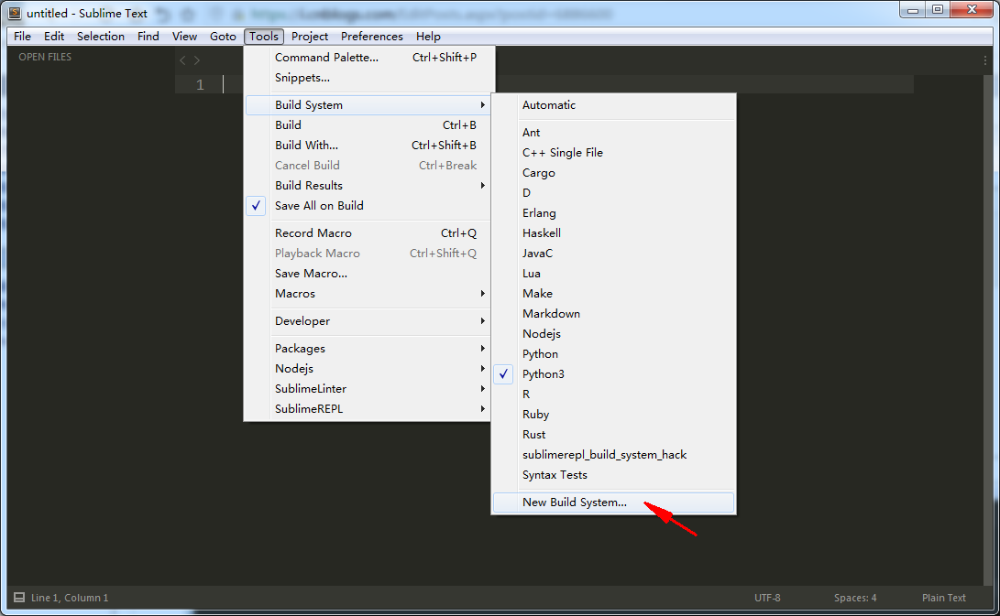

2. 打开Sublime Text 3，依次进入Tools-->Build System-->New Build System； 

   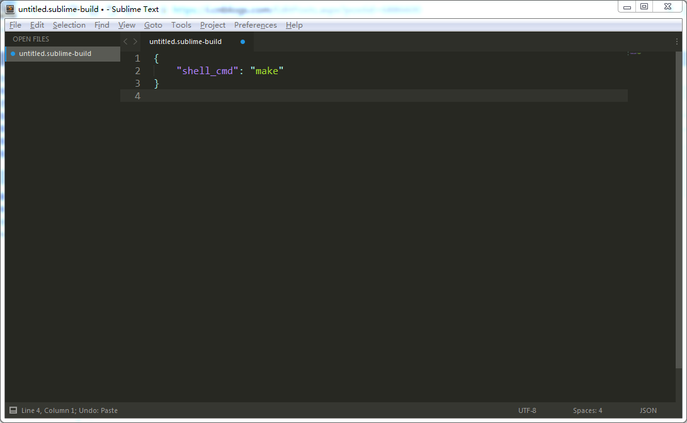

   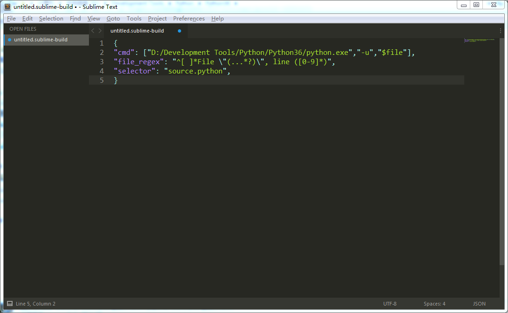

3. 注意下图红线处，配置代码需要匹配Python的安装路径（注意区分正反斜杠）； 

   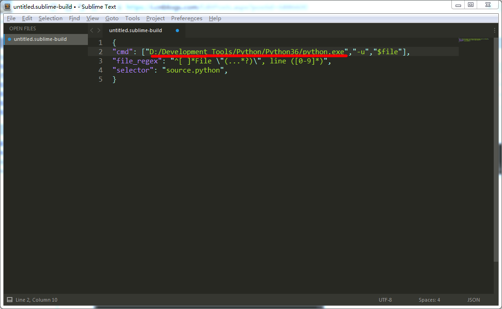

4. 配置完成后点击保存，可自定义文件名，但一定要使用默认路径，这样配置才能生效； 

   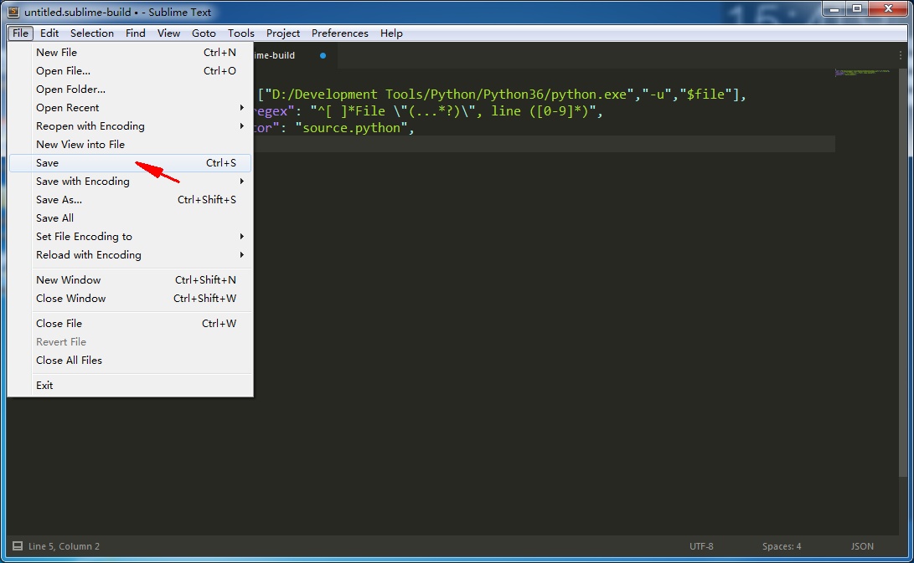

   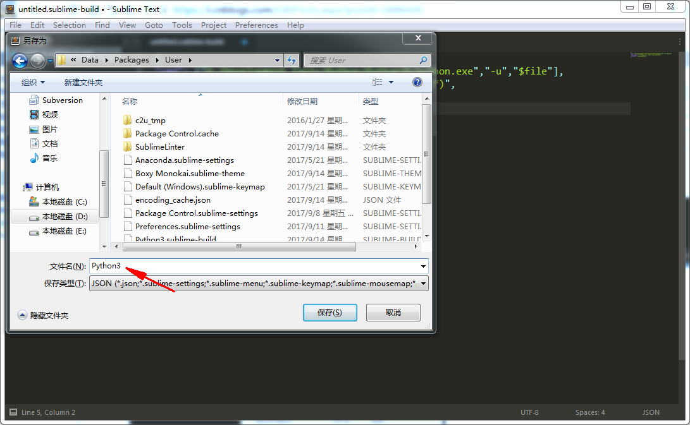

5. 现在，我们重新进入编译环境设置，可以看到刚才添加的Python3编译环境已经出现在候选列表内了，点击勾选就可以切换到Python3编译环境了； 

   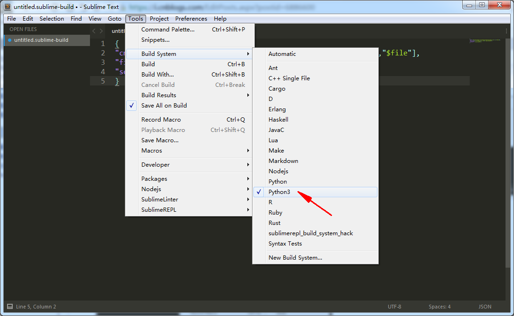

6. 运行(Ctrl+B)一个Python程序测试一下（注意要先保存程序文件，才能正常运行），成功。 

   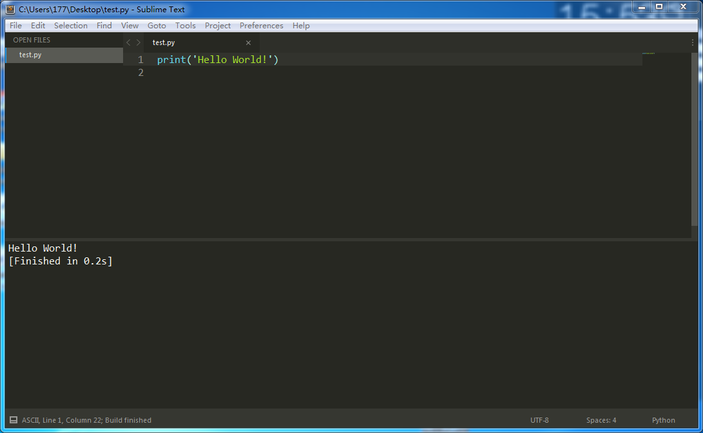

7. 配置代码（XXXXXXXXXX代表Python安装路径，比如  D:/Development Tools/Python/python.exe）：

   ```
   {
       "cmd": ["XXXXXXXXXX","-u","$file"],
       "file_regex": "^[ ]*File \"(...*?)\", line ([0-9]*)",
       "selector": "source.python",
   }
   ```

#### **sublime text3插件**

1. 下载Emmet插件

   百度链接：https://pan.baidu.com/s/1ikODMOromluWCfFZuuiCsA 

   密码：ah5n

2. 打开Sublime Text，依次Preferences→Browse Packages… 打开了一个文件夹，把解压的Emmet插件复制到这个文件夹的目录下

   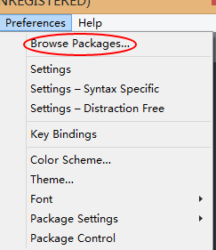

3. 重启Sublime Text，你会看到右下角在下载PyV8，等到下载成功你就可以看到Emmet所在的目录多了一个PyV8的文件夹

   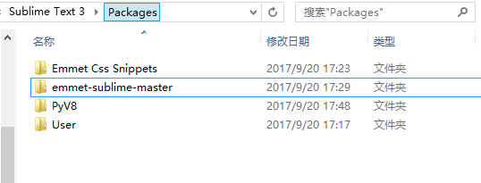

4. 安装成功，重启sublime text3就行


#### **运行python代码错误之can't find 'main' module in ''**

解决办法：保存一下文件即可。

#### ipython 和 ipython notebook安装以及使用

- **安装**

  ```
  pip install IPython
  pip install urllib3 （安装IPython Notebook的依赖）
  pip install jupyter （安装IPython Notebook）
  pip install numpy
  pip install matplotlib
  pip install pandas
  pip install scipy
  pip install scikit-learn
  ```

- **使用**

  ipython的使用：

  ```python
  终端直接输入ipython
  ```

  ipython notebook的使用

  ```
  终端直接输入ipython notebook
  ```

  

  

#### VMware下Ubuntu Server 14.04安装教程（最详细）

[Linux安装](https://www.jianshu.com/p/0f0ed7d8e06e)


#### ipython中进入文件夹

```reStructuredText
# 进入桌面
cd \User\lsmil\desktop
```


#### visual studio code写python代码以及字体的修改

[扩展python](https://blog.csdn.net/lincoco49/article/details/79712102)

[修改字体](https://blog.csdn.net/testcs_dn/article/details/79034096)


#### 解决Ubuntu16.04虚拟机窗口自适应问题

用开源open-vm-tools

```
sudo apt-get install open-vm-tools
sudo apt-get install open-vm*
shutdown -r now
```


#### ubuntu16.04安装配置python3.6

```

```

update命令，会访问源列表里的每个网址，并读取软件列表，然后保存在本地电脑。我们在新立得软件包管理器里看到的软件列表，都是通过update命令更新的。   

upgrade命令，会把本地已安装的软件，与刚下载的软件列表里对应软件进行对比，如果发现已安装的软件版本太低，就会提示你更新。

 安装完成后，更改python命令默认值 :

```
sudo update-alternatives --install /usr/bin/python3 python3 /usr/bin/python3.5 1
sudo update-alternatives --install /usr/bin/python3 python3 /usr/bin/python3.6 2
```

更改默认值，*python*默认为Python2，现在修改为Python3 :

```
sudo update-alternatives --install /usr/bin/python python /usr/bin/python2 100
sudo update-alternatives --install /usr/bin/python python /usr/bin/python3 150
```

如果要切换到Python2，执行： 

```
sudo update-alternatives --config python
```


#### ubuntu16.04安装pycharm专业版

[链接](https://blog.csdn.net/zhuanshu666/article/details/73554885)


#### ubuntu16.04安装pycharm社区版

```python
cd 报所在目录  # 先在终端进入包所在目录

sudo tar zxvf pycharm-community-2017.3.2.tar.gz -C /opt/  # 解压包，opt是解压到home下面的opt文件夹中

cd /opt/pycharm-community-2017.3.2/  # 进入到解压好的文件夹

cd bin  # 进入bin文件夹

sh pycharm.sh  # 运行pycharm
```

**注：以后运行pycharm都要到bin文件夹下运行sh pycharm.sh**


#### Sublime Text3关闭代码提示功能

1、启动Sublime Text 3  

2、单击首选项→设置-用户，如果是英文版的就Setting -> User在用户配置下输入"auto_complete": false,   

3、ctrl+s保存 

**注意事项：一定要把代码输入在{}之中，[]之上。**


#### Sublime Text3去掉白色框框

出现白色框框是因为不符合PEP8标准

可以装一个 AUTOPEP8 插件，然后按 `Ctrl` + `Alt` + 8 就会自动帮你PEP8格式化，白色框框就会消失了

安装步骤：

```
Ctrl + Shift + p
选择install package
输入AUTOPEP8
ok
```

要去掉只需在 Sublime > Preferences > Package Settings > Anaconda > Settings User 中设置关闭：   {“anaconda_linting”: false} 

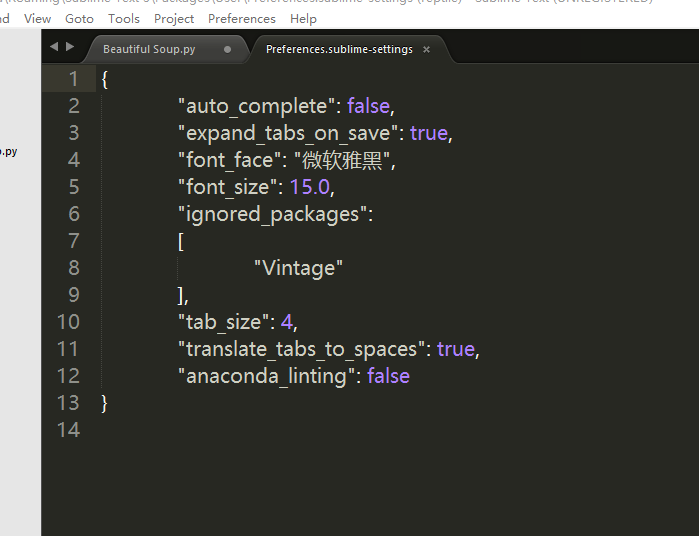


#### github中markdown文档中的图片显示问题

- **方法一，直接把图片的url放入文档的图片地址中**

  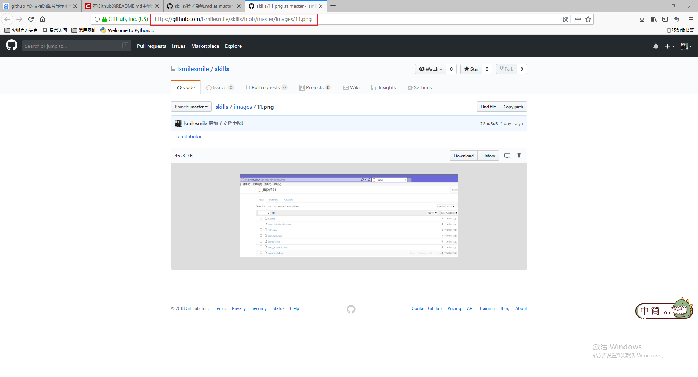

  

  **注：上面第二张图片当然在本地是显示不出来的，把文档上传到github上后就可以在github上显示出来**

- **方法二，用相对地址**

  先直接选择本地图片

  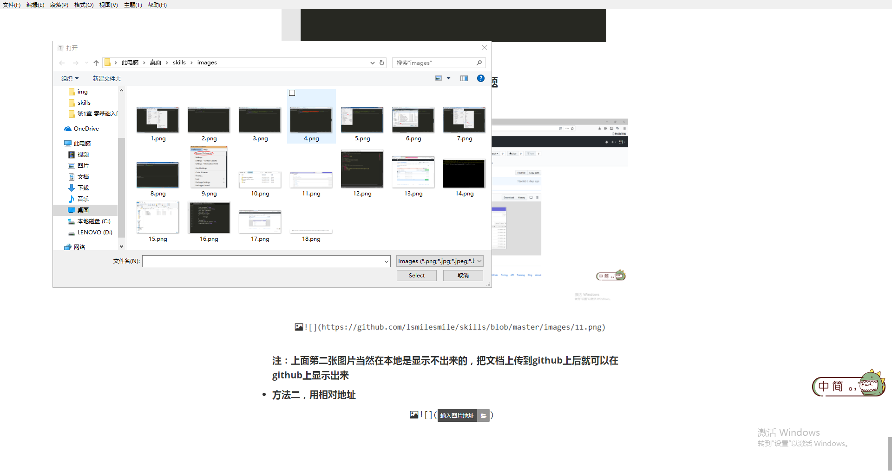

  选择本地图片后，把地址改成下图所示的地址，注意，这时候在本地是可以显示出来的，但是如果传到github上有时候是显示不出来的，解决办法：把下面的正斜杠改成反斜杠即可。

  

  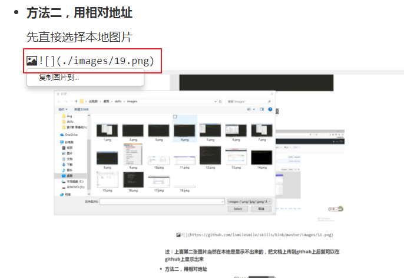

  这样就大功告成！


#### sublime text3 SyncedSidebarBg  修改配色

```
Ctrl+Shift+p
找到install packages
搜索SyncedSidebarBg
如果还没有改变就列一下已经安装的包
```

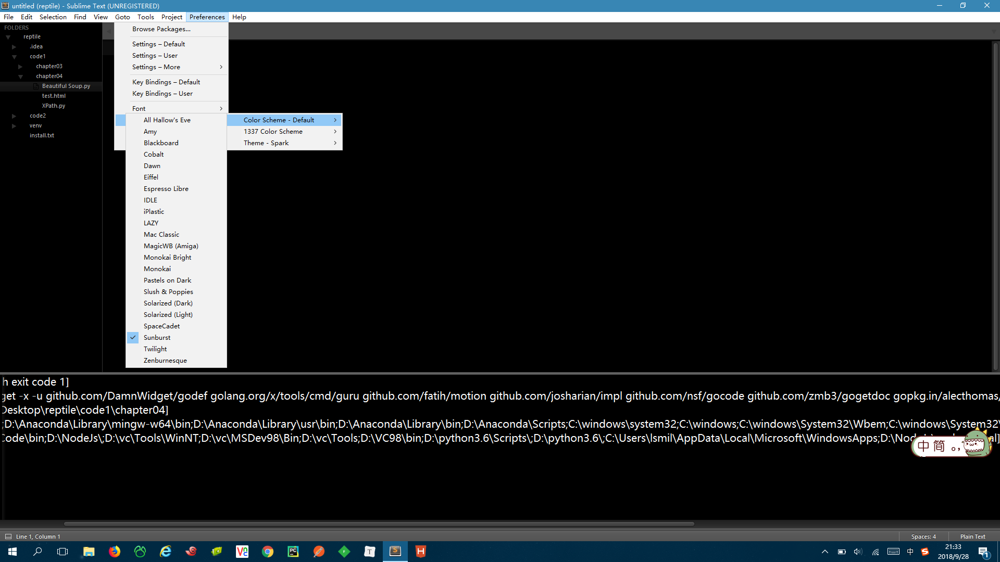

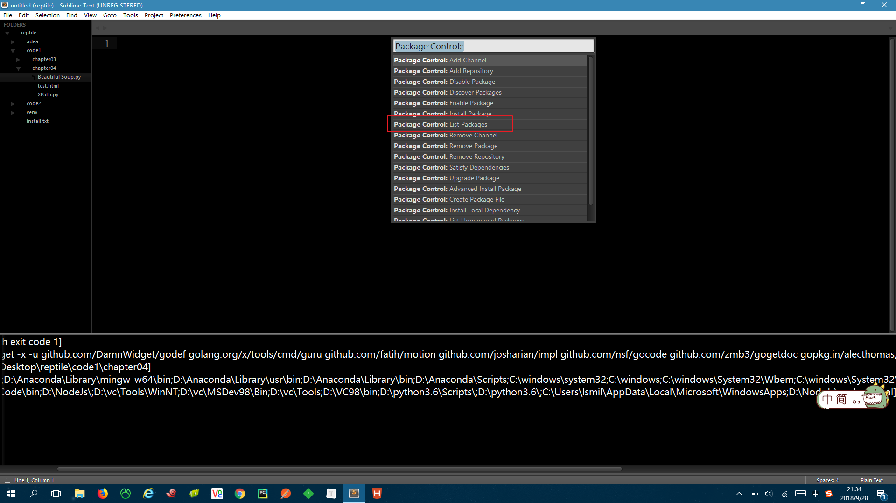


#### Sublime Text3设置左侧导航栏的字体大小和每行高度

1. 安装`PackageResourceViewer` 包

   ```
   Ctrl+Shift+p
   找到Package Control:Install
   输入PackageResourceViewer
   下载
   ```

2. 调整左侧导航栏的字体大小和每行高度

   ```
   Ctrl+Shift+p
   输入PackageResourceViewer: Open Resource 回车，打开包列表
   选择 Theme - Default，再选择 Default.sublimt-theme
   ```

   - 调整字体

     ```
     搜索或直接找到第一个class为sidebar_label，在 "class": "sidebar_label" 后边加一行："font.size": 14
     ```

     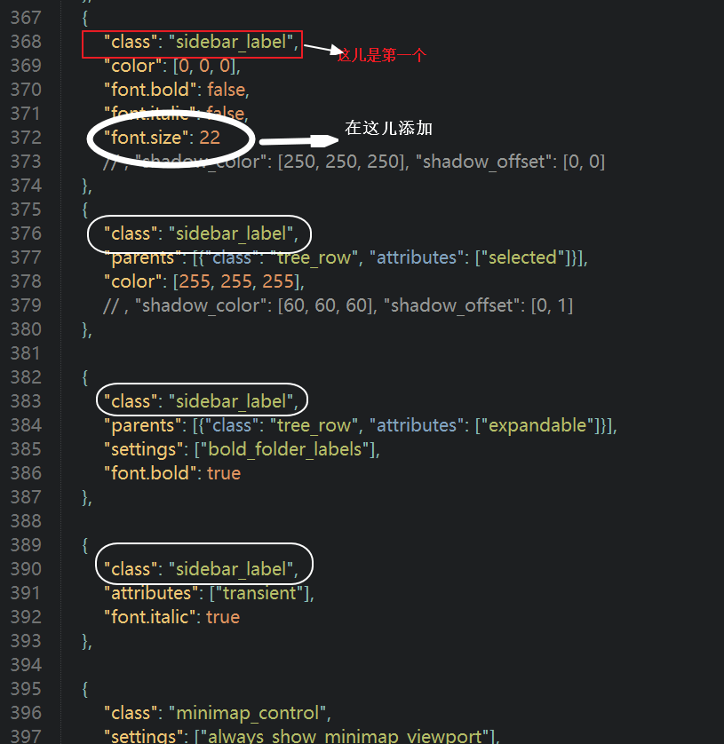

   - 调整高度

     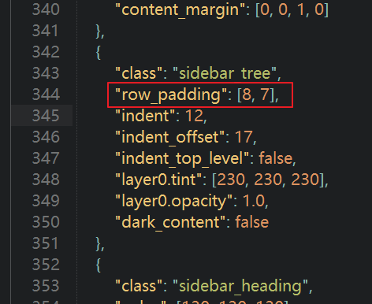


#### sublime text3+Python解决无法输出中文问题

如果要使用自己的虚拟环境

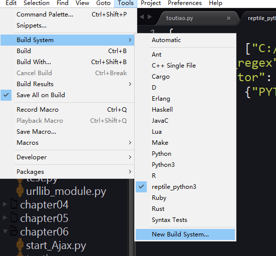

在新建的文件中输入

```
{   
    "cmd": ["C:/Users/lsmil/Desktop/reptile/venv/Scripts/python.exe", "-u", "$file"],
    "file_regex": "^[ ]*File \"(...*?)\", line ([0-9]*)",
    "selector": "source.python",
    "env": {"PYTHONIOENCODING": "utf8"},
}
```

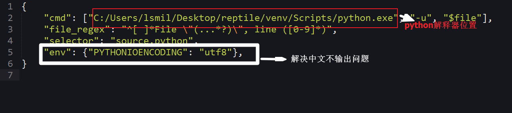


#### python3导入thread模块

在python3中直接导入thread会出现错误

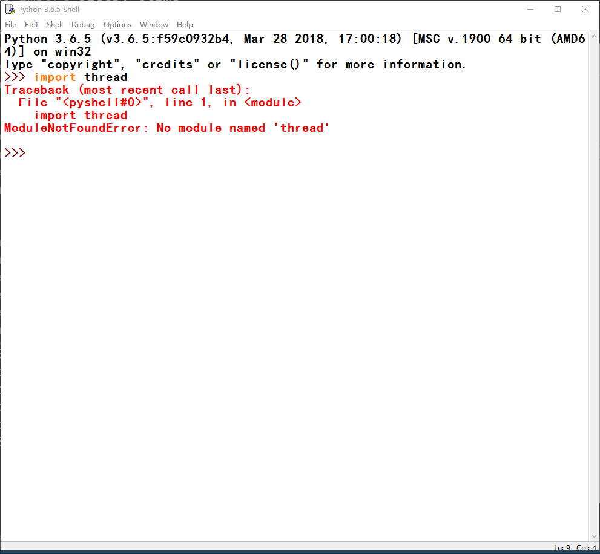

解决办法

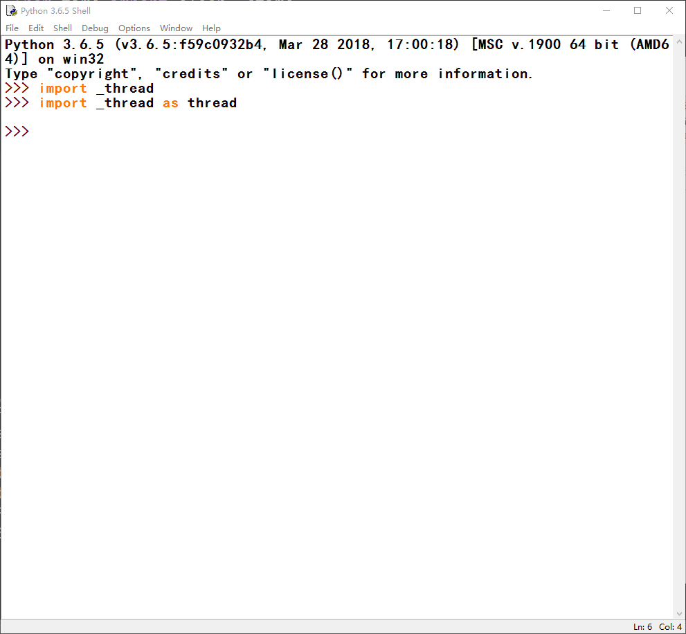